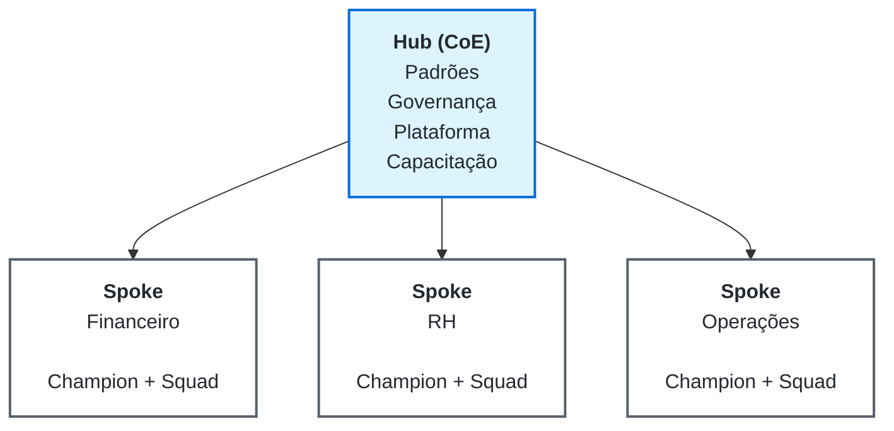
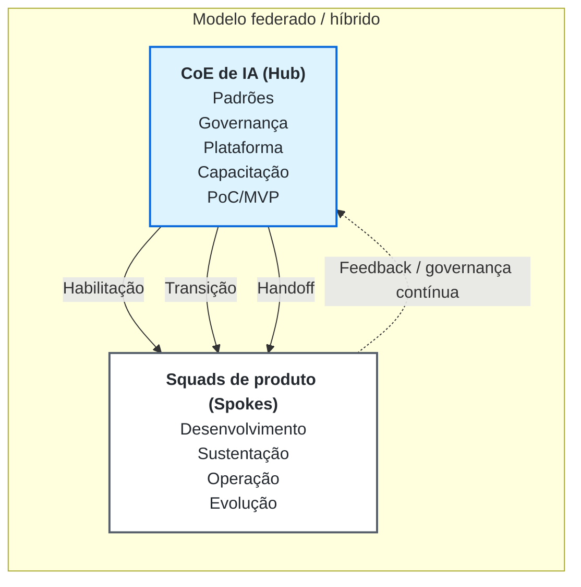
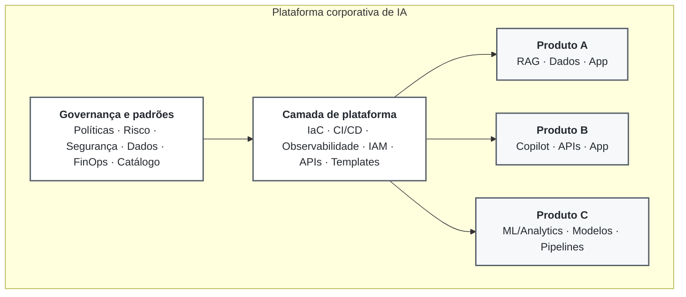
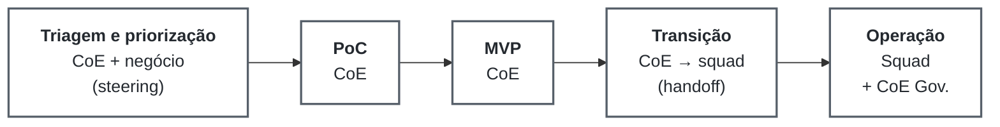
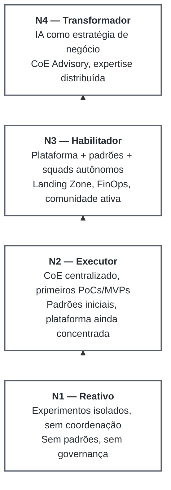

# Centro de Excelência em IA: Guia Prático para Estruturar, Operar e Escalar

> *"Um CoE de IA não é uma fábrica de software — é o motor de transformação que orquestra padrões, talentos e cultura para que toda a organização adote IA de forma estratégica, segura e escalável."*

---

## Resumo executivo

A tese central deste artigo é simples: **um CoE de IA deve criar as condições para que a organização adote IA com consistência, segurança e valor de negócio — não apenas concentrar conhecimento técnico em um time especializado**.

As referências convergem em um ponto: no início da jornada, alguma centralização pode acelerar a criação de capacidades, padrões e primeiros pilotos. Com a maturidade, porém, o CoE deve evoluir para um modelo federado ou consultivo (*advisory*), no qual o núcleo central define estratégia, padrões, governança, avaliação, controles automatizados (*guardrails*), capacitação e ativos reutilizáveis, enquanto as unidades de negócio e tecnologia executam casos de uso dentro desses padrões.

Esse modelo não deve ser dogmático: a intensidade dos controles e das métricas precisa variar conforme contexto organizacional, risco, regulação, missão institucional e presença geográfica.

Em termos práticos, um CoE de IA bem desenhado deve:

1. **Definir estratégia e critérios de priorização** para iniciativas de IA.
2. **Publicar padrões e arquiteturas de referência** para RAG, agentes, MCP, MLOps, LLMOps, avaliação, segurança, observabilidade e FinOps.
3. **Estabelecer governança de IA responsável**, alinhada a NIST AI RMF, ISO/IEC 42001, OECD AI Principles e EU AI Act.
4. **Criar ativos reutilizáveis e plataformas habilitadoras**, com automação, templates e controles incorporados.
5. **Capacitar a organização**, formando comunidades de prática e distribuindo conhecimento.
6. **Medir valor, risco, qualidade, custo e sustentabilidade**, não apenas volume de experimentos ou número de modelos.

**Palavras-chave:** Centro de Excelência em IA; governança de IA; IA generativa; IA agêntica; NIST AI RMF; ISO/IEC 42001; LLMOps; MCP; FinOps.

---

## 1. Introdução

A Inteligência Artificial deixou de ser uma aposta de longo prazo para se tornar uma prioridade estratégica imediata. Guias executivos recentes, como o da KPMG (2024), mostram que a pressão por IA e automação já chegou ao topo da agenda corporativa. Entretanto, existe um gap considerável entre a ambição executiva e a capacidade real de implementação — especialmente no que diz respeito à avaliação de retorno e à gestão de riscos associados à IA.

Com o avanço dos modelos de linguagem (LLMs), técnicas como RAG (Retrieval-Augmented Generation), arquiteturas multi-agente e a emergência da IA agêntica, as organizações enfrentam um dilema: **como adotar IA de forma coordenada, segura e escalável, sem que cada área reinvente a roda?**

A resposta mais comum — e comprovadamente eficaz — é a criação de um **Centro de Excelência em IA (CoE de IA)**: uma estrutura organizacional dedicada a incentivar a adoção, otimização e governança da IA em toda a organização. O CoE funciona como um hub centralizado de conhecimento especializado, boas práticas e recursos, garantindo que as iniciativas de IA estejam alinhadas aos objetivos estratégicos e gerem valor real de negócio (IBM, 2024).

Entretanto, muitas organizações tropeçam na execução. O conhecimento técnico especializado necessário para implementar IA frequentemente se encontra **fragmentado entre equipes**, levando a ineficiências, resultados inconsistentes e esforços duplicados (IBM, 2024). Sem uma estrutura dedicada, os projetos de IA proliferam de forma desordenada — cada time escolhe seu próprio stack, define seus próprios padrões (ou nenhum) e cria débito técnico que se acumula silenciosamente.

Pior ainda: quando o CoE é criado mas assume responsabilidades demais, opera como único executor de iniciativas e não define um caminho claro de transição para times de produto e plataforma, ele — ironicamente — se torna o gargalo que deveria eliminar.

Este artigo apresenta um **guia prático e abrangente** para estruturar, operar e evoluir um CoE de IA, sintetizando documentação de fornecedores de tecnologia, frameworks de adoção, fontes de mercado publicamente referenciáveis, normas, regulação e pesquisa acadêmica, com ênfase em:

- Definição, papéis e composição de equipe
- Modelos de atuação e quando usar cada um
- Os pilares fundamentais: padrões, governança, capacitação e FinOps
- Arquitetura de referência e plataforma cloud para IA, incluindo portabilidade, soberania de dados e sustentabilidade
- O ciclo de vida de soluções de IA dentro do CoE
- O CoE na era da IA generativa e agêntica
- Anti-patterns comuns e como evitá-los
- Modelo de maturidade para evolução progressiva
- Métricas e KPIs para medir o sucesso do CoE

### 1.1. Método editorial e escopo da revisão

Este texto é uma **revisão narrativa orientada à prática**, combinando literatura técnica, documentação de fornecedores, normas, regulação, white papers de mercado e artigos acadêmicos selecionados. Não se trata de revisão sistemática, metanálise ou pesquisa empírica primária.

As fontes foram incluídas quando atendiam a pelo menos um dos seguintes critérios: (1) serem documentação oficial ou framework de adoção de IA de fornecedor relevante; (2) tratarem diretamente de CoE, operating model, governança, MLOps/LLMOps ou arquitetura de IA; (3) serem norma, regulação ou framework amplamente usado em governança de IA; (4) oferecerem base acadêmica para desenho organizacional, governança ou colaboração humano-IA. A revisão foi atualizada em **21 de maio de 2026**; por isso, referências de 2026 e a nomenclatura atual da Microsoft Foundry foram verificadas nessa janela.

Como limitação, o artigo sintetiza recomendações e padrões recorrentes, mas não mede estatisticamente a taxa de sucesso de CoEs nem substitui avaliação jurídica, regulatória ou arquitetural específica. Fontes que exigem assinatura ou acesso privado foram excluídas como referência bibliográfica; quando uma fonte pública apresenta bloqueio anti-bot em alguns acessos automatizados, ela é usada apenas como apoio complementar e nunca como única base para uma recomendação crítica. As metas numéricas usadas nas seções de métricas são **exemplos para calibração interna**, não benchmarks universais.

A presença recorrente do Microsoft Cloud Adoption Framework decorre de sua especificidade para o tema "AI CoE" e de sua documentação operacional sobre transição do CoE de executor para modelo consultivo. Para reduzir dependência editorial de uma única fonte, as recomendações foram cruzadas com IBM, KPMG, Deloitte, Oracle/CIO, Google Cloud, AWS, NIST, ISO/IEC 42001, OECD, EU AI Act e literatura acadêmica.

**Política de termos:** termos em inglês foram mantidos quando são nomes consagrados no mercado ou em documentação técnica — por exemplo, *hub-and-spoke*, *guardrails*, *LLMOps*, *MCP* e *FinOps*. Quando possível, o termo em português aparece junto da primeira ocorrência: triagem (*intake*), consultivo (*advisory*), embaixadores (*champions*), autoatendimento governado (*self-service*) e reversão (*rollback*).

---

## 2. O que é um CoE de IA — e o que ele não é

### 2.1. Definição

Um CoE de IA é uma **estrutura organizacional interna e multidisciplinar** dedicada a impulsionar a adoção, padronização e governança de IA em toda a organização. Ele serve como um hub centralizado que conecta áreas de negócio, TI, dados, conformidade e segurança.

Diversas referências da indústria convergem para uma definição semelhante:

> **IBM (2024):** *"Um centro de excelência em IA é uma estrutura organizacional dedicada a incentivar a adoção, otimização e governança da IA em toda a organização. Ele serve como um hub de conhecimento especializado, melhores práticas e recursos."*

> **Microsoft CAF (2025):** *"Um CoE de IA consiste em um time interno de especialistas que impulsiona resultados de IA bem-sucedidos e valiosos. O CoE previne a adoção fragmentada ou desgovernada de IA."*

O conceito é uma evolução do modelo mais amplo de "Centro de Excelência", utilizado historicamente em TI, desenvolvimento de software e outros campos especializados (IBM, 2024). Porém, a natureza única da IA — com seus requisitos de dados, ética, regulamentação e evolução tecnológica acelerada — exige adaptações significativas.

### 2.2. Funções essenciais

De acordo com a síntese de múltiplas fontes (IBM, Microsoft, KPMG, Deloitte), as funções fundamentais de um CoE de IA são:

**Tabela 1 — Funções essenciais de um CoE de IA**

| Função | Descrição | Referência |
|---|---|---|
| **Alinhamento estratégico** | Prioriza casos de uso de IA com base em impacto de negócio e viabilidade técnica. Promove a colaboração entre unidades de negócio e equipes técnicas | IBM, KPMG, Microsoft |
| **Definição de padrões** | Estabelece arquiteturas de referência, stack tecnológico, templates reutilizáveis e catálogo de serviços | Microsoft CAF, Deloitte |
| **Governança e supervisão** | Define políticas de uso responsável, conformidade regulatória, gestão de riscos e ciclo de vida de modelos | NIST, ISO/IEC 42001, OECD, EU AI Act |
| **Compartilhamento de conhecimento** | Documenta lições aprendidas, mantém repositórios internos e promove fóruns de discussão | IBM, Google |
| **Capacitação tecnológica** | Fornece infraestrutura compartilhada, ferramentas padronizadas e plataformas de desenvolvimento | Google, AWS |
| **Desenvolvimento de talentos** | Promove treinamentos, workshops, certificações, hackathons e comunidades de prática | IBM, KPMG |

### 2.3. O que o CoE **NÃO** é

- **Não é uma fábrica de software** — não deve ser o dono permanente de produtos de IA. Constrói PoCs/MVPs e transfere para squads de produto.
- **Não é apenas um time de infraestrutura** — deve definir padrões, controles automatizados (*guardrails*) e capacidades reutilizáveis, não apenas operar recursos técnicos.
- **Não é um comitê bloqueador (*gatekeeper*)** — não deve paralisar iniciativas; deve acelerá-las com controles claros.
- **Não é um time de suporte** — não deve ser acionado para resolver problemas operacionais do dia a dia.
- **Não é um projeto com data de término** — é uma capacidade organizacional permanente que evolui com a maturidade da empresa.

---

## 3. Equipe e Papéis-Chave

A composição da equipe é um dos fatores mais críticos para o sucesso do CoE. Segundo o Microsoft Cloud Adoption Framework (2025), o CoE precisa de **liderança, expertise técnica e alinhamento organizacional** adequados. A KPMG (2024) reforça que o time deve funcionar como **ponte entre a liderança executiva e as equipes técnicas**.

### 3.1. Papéis fundamentais

**Tabela 2 — Papéis fundamentais no CoE de IA**

| Papel | Responsabilidades | Perfil |
|---|---|---|
| **Sponsor Executivo** | Garante orçamento, autoridade e credibilidade organizacional. Sem patrocínio executivo, o CoE não consegue fazer cumprir padrões ou impulsionar mudanças | C-level (CIO, CTO, CDO ou CAIO) |
| **Líder do CoE** | Dirige as iniciativas de IA, atua como ponto focal para a estratégia e influencia stakeholders em todos os níveis | Líder sênior com expertise em IA e habilidade de gestão |
| **AI/ML Engineers** | Desenvolvem, treinam, implantam e monitoram modelos de IA. Definem arquiteturas de referência | Engenheiros seniores com experiência em MLOps/LLMOps |
| **Data Scientists** | Analisam dados, projetam experimentos e avaliam a viabilidade técnica de casos de uso | Cientistas de dados com domínio de negócio |
| **Data Engineers** | Constroem e mantêm pipelines de dados, garantem qualidade e acessibilidade dos dados | Engenheiros de dados com experiência em cloud |
| **Especialista em Governança/Ética** | Define políticas de IA responsável, monitora conformidade regulatória e avalia riscos éticos | Background em compliance, direito digital ou ética aplicada |
| **Especialista em Segurança** | Garante a segurança dos modelos, dados e APIs. Define controles de segurança | Security engineer com conhecimento em segurança de IA |
| **Representantes de Negócio** | Identificam casos de uso relevantes, avaliam ROI e garantem alinhamento com necessidades reais | Product owners ou analistas de negócio |
| **Change Management** | Gerencia a transformação cultural, comunicação e adoção | Especialista em gestão de mudança |

### 3.2. Posicionamento organizacional

O Microsoft CAF (2025) orienta que, se a organização já opera um **Cloud Center of Excellence (CCoE)**, é preferível **integrar as práticas de IA a esse time existente** em vez de criar uma estrutura isolada. Um CoE de IA standalone só deve ser criado quando os times atuais não conseguem suportar a adoção de IA ou quando existem riscos críticos que justifiquem a separação.

O objetivo é evitar complexidade desnecessária e construir sobre fundações existentes — infraestrutura cloud, governança de dados, práticas DevOps — em vez de operar isoladamente.

### 3.3. Modelo hub-and-spoke

As fontes analisadas de operating model, especialmente Microsoft CAF e literatura de arquitetura organizacional, convergem para o modelo **hub-and-spoke**, onde:

- **Hub (central):** equipe núcleo do CoE com expertise técnica avançada, responsável por padrões, governança e plataformas.
- **Spokes (distribuídos):** embaixadores (*champions*) de IA em cada unidade de negócio, conectados ao hub, responsáveis por identificar oportunidades e implementar soluções localmente.

**Figura 1 — Modelo conceitual hub-and-spoke para CoE de IA**

---

## 4. Modelos de Atuação

Não existe um modelo único. O melhor formato depende da maturidade da organização, do tamanho da empresa e da cultura de TI. Os três modelos mais comuns, consolidados a partir das fontes analisadas, são:

### 4.1. Modelo Centralizado (Executor)

O CoE **desenvolve e entrega** as soluções de IA diretamente, concentrando toda a expertise e capacidade de execução.

**Quando usar:** fase inicial da jornada de IA, quando a organização ainda não possui squads com competência em IA (Microsoft CAF, 2025).

**Vantagem:** velocidade inicial, controle de qualidade, consolidação de expertise.

**Risco:** o CoE vira fábrica de software, cria gargalos de aprovação e não consegue escalar. A equipe do CoE se torna knowledge bottleneck.

### 4.2. Modelo consultivo (*advisory*)

O CoE atua como **consultor e guardião de padrões** — define padrões, publica guias, estabelece controles e responde a consultas, mas **não executa** projetos diretamente. As equipes de produto desenvolvem suas próprias soluções sob orientação do CoE.

**Quando usar:** organizações maduras, com squads autônomos que possuem competência técnica em IA. O Microsoft CAF (2025) descreve este como o **estágio evoluído** do CoE.

**Vantagem:** alta escalabilidade, baixo risco de gargalo, inovação descentralizada.

**Risco:** padrões podem ser ignorados se não houver enforcement adequado.

### 4.3. Modelo Federado / Híbrido (Recomendado)

O CoE **centraliza padrões, governança e plataforma**, mas **distribui a execução** para squads e unidades de negócio. Constrói as primeiras versões (PoC/MVP), define a arquitetura de referência e **transfere** para squads de produto.

Em termos práticos, este modelo separa capacidades comuns — políticas, padrões de plataforma, avaliações, controles, catálogo de modelos e controle de custos — daquilo que precisa ficar próximo do domínio de negócio: priorização de casos de uso, desenho de experiência, operação funcional e evolução do produto.

**Quando usar:** maioria dos casos — permite entregar valor rápido enquanto constrói maturidade organizacional.

**Vantagem:** equilíbrio entre velocidade e escalabilidade.

**Risco:** requer disciplina para executar a transição. Sem um plano claro, o CoE nunca "solta" os projetos.

**Figura 2 — Responsabilidades no modelo federado/híbrido**

### 4.4. A evolução natural: do executor ao modelo consultivo

O Microsoft Cloud Adoption Framework (2025) descreve uma **trajetória evolutiva** clara para o CoE:

1. **Reconhecer pontos de inflexão** — monitorar indicadores de que o controle centralizado está prejudicando em vez de ajudar: filas de aprovação, gargalos de conhecimento, times debatendo prioridades em vez de entregando valor
2. **Embutir a entrega de IA nas operações de plataforma** — transferir a responsabilidade de deploy e operação para times de plataforma, mantendo governança consistente
3. **Transicionar para o modelo consultivo** — substituir o modelo bloqueador por um modelo de controles e orientação. Distribuir expertise de IA nos times de produto e manter fóruns de governança e supervisão

> *"Deslocar o CoE para um papel consultivo ajuda os times a inovar rapidamente mantendo padrões e segurança."* — Microsoft CAF, 2025

### 4.5. Direitos de decisão no modelo federado

O modelo federado só funciona quando os direitos de decisão são explícitos. Sem essa separação, o CoE vira comitê bloqueador ou os squads passam a tratar padrões corporativos como recomendações opcionais.

> **Quadro 1 — Direitos de decisão no modelo federado**  
> **CoE de IA:** decide padrões mínimos, catálogo de modelos aprovados, critérios de avaliação, requisitos de observabilidade e Definition of Done para handoff.  
> **Produto/negócio:** decide backlog funcional, experiência do usuário, priorização de domínio e evolução do produto, dentro dos padrões aprovados.  
> **Plataforma/cloud:** decide padrões de provisionamento, automação, integração, monitoramento e operação técnica.  
> **Segurança, risco e compliance:** definem controles obrigatórios e têm poder de veto em casos de alto risco.  
> **Sponsor executivo:** decide trade-offs de investimento, risco residual e go/no-go executivo quando há impacto material.

### 4.6. Vinheta pública: Nationwide Building Society

Um exemplo público útil vem da Nationwide Building Society, organização financeira do Reino Unido. Segundo case study publicado pela IBM em 2025, a Nationwide iniciou sua jornada de IA generativa com uma estratégia e um modelo operacional em nível institucional, culminando na criação de um **AI Centre of Expertise** apoiado pela IBM Consulting e baseado em Microsoft Azure OpenAI Service.

> **Quadro 2 — Vinheta pública: CoE em organização financeira regulada**  
> O centro combinou três capacidades: uma equipe de operações para conduzir o ciclo de vida de IA, um conselho multifuncional para avaliar casos de uso e uma função de delivery para construir soluções com LLMs e dados corporativos. Também definiu padrões técnicos, princípios de entrega, plataforma de IA generativa, treinamento, comunicação, processos de implementação e redesenho de governança e gestão de risco envolvendo áreas como jurídico, tecnologia, segurança e dados.  
>  
> A vinheta é relevante porque mostra o CoE como mecanismo de coordenação, prontidão operacional e governança em ambiente regulado — não apenas como squad de chatbot. A própria fonte descreve iniciativas como gestão de contratos, garantia de qualidade, relatórios operacionais e apoio a interações de colaboradores com clientes.  
>  
> Limite editorial: trata-se de um case study de fornecedor, não de estudo independente revisado por pares. Portanto, ele deve ser lido como vinheta ilustrativa pública, não como benchmark quantitativo universal.

---

## 5. Os Pilares do CoE de IA

### 5.1. Padrões e Arquitetura de Referência

O CoE deve entregar **padrões antes de produtos**. Sem padrões claros, cada projeto toma decisões diferentes e cria débito técnico que se acumula exponencialmente. A Deloitte recomenda manter um **repositório central de assets reutilizáveis**: modelos, dados, frameworks e código.

**Entregas esperadas:**

- **Arquitetura de referência** para cada padrão de IA (RAG, fine-tuning, agentes, ML clássico)
- **Stack tecnológico padrão** — frameworks, bibliotecas, serviços de cloud homologados
- **Templates de projeto** — repositórios-modelo com estrutura de código, CI/CD, testes, observabilidade
- **Catálogo de serviços de IA** — quais modelos estão homologados, quais APIs estão disponíveis, custos estimados
- **Guias de prompt engineering** — boas práticas para uso de LLMs internamente
- **Blueprints de infraestrutura** — templates de IaC (Bicep/Terraform) para provisionamento padronizado

### 5.2. Governança e IA Responsável

A governança é o que diferencia um CoE estratégico de um grupo técnico informal. Com a crescente ênfase regulatória e ética no desenvolvimento de IA, a supervisão centralizada se tornou imprescindível (IBM, 2024).

#### 5.2.1. NIST AI Risk Management Framework (AI RMF)

O NIST AI RMF (2023) oferece um framework voluntário com quatro funções centrais que se aplicam diretamente à governança do CoE. Em 2024, o NIST também publicou o **Generative AI Profile (NIST AI 600-1)**, com riscos específicos de IA generativa — como confabulação, vazamento de dados, conteúdo prejudicial, uso indevido e riscos de segurança.

**Tabela 3 — Aplicação do NIST AI RMF ao CoE de IA**

| Função | Descrição | Aplicação no CoE |
|---|---|---|
| **Govern** | Estabelecer políticas, estruturas e processos de supervisão | Definir charter do CoE, comitês de ética, políticas de uso |
| **Map** | Identificar e documentar contextos, propósitos e riscos dos sistemas de IA | Avaliar cada caso de uso antes de iniciar desenvolvimento |
| **Measure** | Avaliar, analisar e benchmarkar riscos e eficácia dos controles | Implementar avaliações contínuas de qualidade e viés |
| **Manage** | Implementar estratégias de mitigação, monitorar e ajustar | Operar controles, monitorar alucinações, responder a incidentes |

#### 5.2.2. ISO/IEC 42001 — Sistema de Gestão de IA

A ISO/IEC 42001:2023 é a primeira norma internacional para **Artificial Intelligence Management System (AIMS)**. Ela especifica requisitos para estabelecer, implementar, manter e melhorar continuamente um sistema de gestão de IA, com foco em uso responsável, rastreabilidade, transparência, confiabilidade e gestão de riscos.

Para um CoE de IA, a ISO/IEC 42001 é útil porque desloca a discussão de governança de controles pontuais para um **sistema de gestão contínuo**, integrável a práticas já conhecidas em empresas maduras, como ISO 9001 (qualidade) e ISO/IEC 27001 (segurança da informação).

#### 5.2.3. OECD AI Principles — Princípios de IA confiável

Os princípios da OECD, adotados em 2019 e atualizados em 2024, são uma referência internacional para IA confiável. Eles reforçam cinco dimensões que o CoE deve traduzir em políticas e práticas:

- Crescimento inclusivo, desenvolvimento sustentável e bem-estar
- Direitos humanos, valores democráticos, justiça e privacidade
- Transparência e explicabilidade
- Robustez, segurança e safety
- Accountability

#### 5.2.4. EU AI Act — Classificação de Risco

O EU AI Act (2024), a primeira lei abrangente regulando IA no mundo, estabelece uma classificação que o CoE deve adotar como referência:

**Tabela 4 — Classificação de risco inspirada no EU AI Act**

| Nível de risco | Exemplos | Requisitos |
|---|---|---|
| **Risco inaceitável** | Pontuação social, manipulação subliminar | **Proibido** |
| **Alto risco** | Biometria, recrutamento, infraestrutura crítica, saúde | Avaliação de risco, datasets de qualidade, rastreabilidade, supervisão humana, registro em base de dados da UE |
| **Risco limitado** | Chatbots, deepfakes, reconhecimento de emoção | Obrigações de transparência — informar que é IA |
| **Risco mínimo** | Filtros de spam, IA em jogos | Sem obrigações específicas |

#### 5.2.5. Pilares da governança aplicada

- **Ética e viés** — processos para avaliar e mitigar viés algorítmico, com avaliação adversarial (*red teaming*) regular
- **Privacidade e conformidade** — aderência à LGPD, GDPR, regulamentações setoriais e EU AI Act
- **Segurança** — proteção contra prompt injection, data leakage, excessive agency, model poisoning
- **Observabilidade** — monitoramento de alucinações, drift de modelos, custos e performance
- **Ciclo de vida de modelos** — da criação à desativação, com versionamento, auditoria e reversão (*rollback*)
- **Explainability** — rastreabilidade de decisões, especialmente em sistemas RAG (link para fontes recuperadas)
- **Resposta a incidentes** — plano de escalação para falhas, uso indevido ou alucinações críticas

A classificação interna abaixo deriva da taxonomia do EU AI Act, adaptada para uso interno do CoE. Ela funciona como uma camada de tradução operacional: transforma categorias regulatórias amplas em níveis de controle aplicáveis ao ciclo de vida de projetos.

**Tabela 5 — Exemplo de classificação de risco e controles progressivos**

| Nível | Exemplos de uso | Controles mínimos |
|---|---|---|
| **Baixo** | Uso interno, dados não sensíveis, assistência ao usuário | Revisão por pares e documentação básica |
| **Médio** | Dados pessoais, decisões auxiliares, chatbots e copilots internos | Avaliação de viés, DPIA quando aplicável, transparência e logs de auditoria |
| **Alto** | Decisões autônomas, dados críticos, público externo, infraestrutura crítica ou ambiente regulado | Comitê de ética/risco, auditoria independente quando aplicável, supervisão humana, registro regulatório e monitoramento contínuo |

#### 5.2.6. AI red teaming e avaliação adversarial

O NIST AI 600-1 dá peso explícito a riscos específicos de IA generativa, como confabulação, geração de conteúdo inseguro, vazamento de dados, abuso de ferramentas, ataques de prompt injection e excesso de autonomia. Por isso, o CoE deve manter uma prática recorrente de **AI red teaming**: testes adversariais planejados para descobrir falhas antes que usuários, atacantes ou integrações externas as explorem.

Na prática, essa disciplina inclui bibliotecas de prompts adversariais, testes de jailbreak, verificação de vazamento de dados sensíveis, avaliação de acesso indevido a ferramentas, simulação de abuso de agentes e trilha de remediação. O resultado não deve ser apenas um relatório; deve alimentar critérios de aceite, políticas automatizadas, testes de regressão e limites operacionais.

#### 5.2.7. Avaliação contínua de modelos e respostas

Avaliações (*evals*) não são uma etapa única antes da entrada em produção. Para RAG, agentes e copilots, o CoE deve definir métricas mínimas de qualidade, segurança e custo: groundedness, relevância, precisão, taxa de recusa correta, toxicidade, viés, latência, custo por interação e taxa de escalonamento humano. Essas avaliações devem ser executadas em desenvolvimento, antes de mudanças de modelo, prompt, ferramenta ou política de recuperação, e continuamente em produção com amostragens e golden datasets. Na prática, cada mudança relevante deve disparar uma **avaliação de regressão**: o mesmo conjunto de perguntas, documentos e cenários críticos é reexecutado para detectar degradação de qualidade, segurança ou custo antes do rollout.

### 5.3. Capacitação e Comunidade

O CoE que não capacita outros times está condenado a ser um gargalo eterno. A IBM (2024) enfatiza que o CoE deve organizar **programas de treinamento, workshops e conferências internas** para aprimorar as habilidades dos funcionários, promovendo uma cultura de aprendizado contínuo.

**Estratégias de capacitação:**

- **AI Literacy Program** — treinamento básico para toda a organização (o que é IA, como usar ferramentas como Copilot, ChatGPT, quando e quando não usar IA)
- **Bootcamps técnicos** — para desenvolvedores e engenheiros (RAG, LangChain, Semantic Kernel, MLOps, LLMOps)
- **Certificações** — programas de certificação em cloud AI (Azure AI Engineer, AWS ML Specialty, Google Cloud ML Engineer)
- **Comunidades de prática** — encontros regulares para compartilhar experiências, desafios e soluções
- **Inner Source** — repositórios internos com código, templates e documentação abertos para contribuição
- **Programa de embaixadores (*champions*)** — representantes de IA em cada área de negócio (modelo hub-and-spoke)
- **Hackathons e P&D** — eventos regulares para estimular experimentação e criatividade (IBM, 2024)
- **Parcerias acadêmicas** — colaboração com universidades e comunidades de código aberto para atração de talentos

### 5.4. FinOps para IA

Um pilar frequentemente negligenciado é **gerenciar iniciativas de IA como um portfólio de produtos**, com uso vinculado diretamente a valor de negócio e controle financeiro rigoroso. Essa disciplina conecta as recomendações de priorização da KPMG, a ênfase do Microsoft CAF em KPIs e a preocupação dos frameworks well-architected com custo, operação e sustentabilidade.

**Práticas de FinOps para IA:**

- **Visibilidade de custos** — dashboards por projeto, por modelo, por ambiente (dev/staging/prod)
- **Chargeback/showback** — atribuição de custos às áreas consumidoras
- **Otimização de modelos** — uso de modelos menores quando possível, caching de respostas, batching de requests
- **Gestão de tokens** — monitoramento e limites de consumo de tokens por aplicação
- **Budget alerts** — alertas proativos quando custos ultrapassam thresholds definidos
- **Right-sizing** — ajuste contínuo de capacidade computacional (GPU, TPU, instâncias)
- **Sustentabilidade** — escolha proporcional de modelos, cache, redução de retraining desnecessário e preferência por regiões/arquiteturas mais eficientes quando compatível com requisitos regulatórios e de residência de dados (Microsoft Well-Architected e Google Cloud Well-Architected)

### 5.5. Adaptação por contexto organizacional

Os pilares do CoE — estratégia, padrões, governança, capacitação, plataforma e FinOps — são relativamente estáveis. O que muda é a **intensidade dos controles**, o grau de formalidade do processo decisório, os critérios de risco e a forma como valor é medido. Um CoE maduro não aplica o mesmo desenho operacional a todos os contextos; ele adapta o modelo à regulação, ao risco, à missão institucional e ao tipo de produto digital da organização.

> **Quadro 3 — Organizações reguladas: bancos, saúde, governo, utilities**  
> O CoE deve reforçar classificação de risco, trilhas de auditoria, explicabilidade, human-in-the-loop, segregação de funções, continuidade operacional, privacidade e gestão formal do ciclo de vida dos modelos. O sucesso não é apenas velocidade de adoção; é adoção com rastreabilidade, resiliência e conformidade.  
> **Anti-pattern típico:** tratar casos de alto impacto como experimentos comuns, sem evidência auditável, dono de risco e supervisão humana definida.  
> **Métrica útil:** percentual de casos de alto risco com avaliação formal, trilha de auditoria, owner de risco e controles de supervisão implementados.

> **Quadro 4 — Organizações digitais: SaaS, varejo, marketplaces e plataformas**  
> O CoE tende a priorizar escala, experimentação rápida, integração com produtos digitais, métricas de adoção, A/B testing, observabilidade de experiência, governança de APIs e FinOps rigoroso. O risco central é proliferar pilotos e features de IA sem padrões comuns de qualidade, segurança e custo.  
> **Anti-pattern típico:** lançar funcionalidades de IA em produto sem avaliação contínua, limites de custo, telemetria de qualidade ou critério de reversão (*rollback*).  
> **Métrica útil:** custo por interação, adoção ativa, taxa de conversão experimento→produção e percentual de features com avaliação automatizada em produção.

> **Quadro 5 — Setor público ou organizações com função social**  
> O CoE deve dar peso adicional a transparência, accountability, inclusão, acessibilidade, linguagem simples, auditabilidade pública e impacto sobre cidadãos. A avaliação de uma solução de IA precisa considerar não apenas eficiência operacional, mas também equidade, direito à contestação e confiança institucional.  
> **Anti-pattern típico:** automatizar atendimento ou decisão pública sem explicação compreensível, canal de contestação, acessibilidade ou análise de impacto sobre grupos vulneráveis.  
> **Métrica útil:** percentual de interações com aviso de uso de IA, explicação disponível, canal de contestação e conformidade de acessibilidade.

> **Quadro 6 — Empresas globais ou multi-país**  
> O CoE precisa lidar com governança multi-jurisdição: EU AI Act, GDPR, LGPD, transferências internacionais de dados, políticas regionais de uso de modelos e requisitos locais de soberania. O desenho mais robusto costuma combinar princípios globais comuns com controles locais adaptados a cada jurisdição.  
> **Anti-pattern típico:** aplicar uma política global única para todos os países, ignorando requisitos locais de dados, transparência, risco e soberania.  
> **Métrica útil:** percentual de iniciativas com mapeamento regulatório por jurisdição, revisão de transferência internacional de dados e aprovação regional antes do rollout.

Essa adaptação por contexto evita dois erros simétricos: tratar IA como um tema puramente técnico, ignorando risco e missão institucional; ou transformar o CoE em uma estrutura excessivamente burocrática, incapaz de acompanhar a velocidade dos produtos digitais.

---

## 6. Arquitetura de Referência e Plataforma Cloud

As referências de Microsoft, Google Cloud e AWS convergem em um princípio: workloads de IA precisam de uma base operacional robusta, com automação, segurança, observabilidade, governança de dados, controle de custos e capacidade de escala. O papel do CoE não é escolher manualmente cada recurso técnico de cada projeto, mas sim definir **arquiteturas de referência e mecanismos de plataforma** que tornem o uso de IA repetível e seguro.

### 6.1. Princípios arquiteturais para workloads de IA

Um ambiente corporativo de IA deve considerar:

- **Fundação cloud governada** — landing zones, contas/projetos/ambientes padronizados, identidade, rede, logging e políticas de segurança
- **Automação** — infraestrutura como código, pipelines de CI/CD, templates de deploy e workflows reutilizáveis
- **Segurança por padrão** — gestão de identidade e acesso, criptografia, segregação de ambientes, proteção de dados e revisão de permissões
- **Observabilidade** — logs, métricas, traces, auditoria, monitoramento de modelos e monitoramento de qualidade de respostas
- **Governança de dados** — classificação, linhagem, qualidade, retenção e controles de acesso a dados sensíveis
- **FinOps** — visibilidade e otimização de custos por workload, área, modelo e ambiente
- **Portabilidade de padrões** — arquiteturas de referência que possam ser implementadas em diferentes clouds, ainda que a organização escolha uma cloud principal
- **Soberania e residência de dados** — classificação de dados, restrições de transferência internacional, modelos regionais e controles compatíveis com LGPD, GDPR e políticas locais
- **Sustentabilidade** — seleção proporcional de modelos, eficiência de inferência, redução de treinamento/reprocessamento desnecessário e medição de impacto ambiental quando aplicável

### 6.2. Modelo recomendado: governança central, execução distribuída

O modelo recomendado é uma plataforma governada, com políticas e padrões centrais, mas com execução distribuída pelas equipes responsáveis pelos produtos e casos de uso. Esse desenho está alinhado ao Microsoft Cloud Adoption Framework, ao Google Cloud Well-Architected Framework e ao AWS Well-Architected Machine Learning Lens.

**Figura 3 — Plataforma corporativa de IA com governança central e execução distribuída**

### 6.3. O que deve ser comum

- **Políticas de segurança e conformidade** — requisitos mínimos para dados, identidade, rede, auditoria e retenção
- **Arquiteturas de referência** — padrões para RAG, agentes, fine-tuning, inferência, MLOps e LLMOps
- **Catálogo de serviços e modelos homologados** — modelos aprovados, critérios de uso, limitações e custos esperados
- **Templates reutilizáveis** — infraestrutura como código, pipelines, observabilidade, testes e exemplos de implementação
- **Critérios de avaliação** — qualidade, risco, bias, segurança, groundedness, custo e impacto de negócio
- **Controles técnicos (*guardrails*)** — filtragem de conteúdo, logging obrigatório, rate limiting, segregação de ambientes e controle de acesso

### 6.4. O que deve ser responsabilidade dos times de produto

- **Backlog e roadmap do caso de uso**
- **Implementação da aplicação**
- **Operação funcional e evolução contínua**
- **Qualidade da experiência do usuário**
- **Gestão do orçamento do produto**
- **Aderência aos padrões definidos pelo CoE**

### 6.5. Exemplo de mapeamento por cloud

**Tabela 6 — Exemplo de mapeamento de capacidades por cloud**

| Capacidade | Microsoft Azure | AWS | Google Cloud |
|---|---|---|---|
| Fundação governada | Azure Landing Zones, Azure Policy | AWS Organizations, Control Tower | Resource Manager, Organization Policy |
| Modelos, agentes e ferramentas | Azure OpenAI, **Microsoft Foundry** | Amazon Bedrock, SageMaker | Vertex AI, Model Garden |
| Busca/RAG | Azure AI Search | Amazon OpenSearch, Kendra | Vertex AI Search |
| MLOps/LLMOps | Azure ML, GitHub Actions, Azure DevOps | SageMaker, CodePipeline | Vertex AI Pipelines, Cloud Build |
| Governança de dados | Microsoft Purview | AWS Glue Data Catalog, Lake Formation | Dataplex, Data Catalog |
| Observabilidade | Azure Monitor, Log Analytics | CloudWatch | Cloud Logging, Cloud Monitoring |

> **Nota de nomenclatura Microsoft:** a documentação oficial atual usa **Microsoft Foundry** como plataforma unificada para modelos, agentes, ferramentas, avaliações, observabilidade e governança. A própria documentação da Microsoft mapeia "Azure AI Studio / Azure AI Foundry" como nomenclaturas anteriores e "Microsoft Foundry" como nomenclatura atual. Algumas referências legadas ainda podem aparecer durante a transição.

### 6.6. Portabilidade real versus lock-in

"Portabilidade de padrões" não significa portabilidade perfeita de implementação. Uma arquitetura pode manter princípios portáveis — avaliação, observabilidade, controle de acesso, rastreabilidade, FinOps, classificação de risco — e ainda assim depender de serviços específicos de uma cloud. Esse trade-off deve ser explícito.

O papel do CoE é separar **padrões portáveis** de **decisões de plataforma**:

- **Portável:** taxonomia de risco, critérios de avaliação, política de logs, métricas de qualidade, catálogo de controles, requisitos de segurança, templates conceituais.
- **Dependente de fornecedor:** APIs de agentes, formatos de tracing, serviços de busca, ferramentas de avaliação, SDKs, identidade, redes privadas, mecanismos de quota e billing.

Quanto maior o risco de lock-in, mais importante se torna manter ADRs (Architecture Decision Records), testes de regressão independentes de fornecedor, contratos de interface bem definidos e plano de saída realista para modelos, embeddings, índices e ferramentas de orquestração.

---

## 7. Ciclo de Vida: Do PoC ao Produto

O Microsoft CAF (2025) recomenda que o CoE implemente **fluxos estruturados de triagem (*intake*) e priorização** para avaliar e priorizar solicitações de projetos de IA. Isto garante que os projetos sejam avaliados com critérios consistentes de valor de negócio, viabilidade técnica e requisitos de recursos.

### 7.1. As fases

**Figura 4 — Ciclo de vida de uma iniciativa de IA no CoE**

### 7.2. Detalhamento

**Tabela 7 — Fases e entregas do ciclo de vida**

| Fase | Responsável | Duração típica | Entregas |
|---|---|---|---|
| **Triagem (*intake*) e priorização** | CoE + Steering Committee | 1–2 semanas | Business case, avaliação de viabilidade, classificação de risco (NIST Map), priorização no backlog |
| **PoC (Proof of Concept)** | CoE | 2–4 semanas | Protótipo funcional, métricas de viabilidade (acurácia, latência, custo), decisão go/no-go |
| **MVP (Minimum Viable Product)** | CoE | 4–8 semanas | Versão mínima em produção, com observabilidade, controles e segurança |
| **Transição (Handoff)** | CoE → Squad de produto | 2–4 semanas | Documentação, treinamento, transferência de repositório, infra e ownership |
| **Operação** | Squad de produto | Contínuo | Evolução, sustentação, SLA, com governança e orientação consultiva do CoE |

### 7.3. Processo de triagem e priorização

Baseado nas recomendações da KPMG (2024) e Microsoft CAF (2025):

1. **Submissão** — qualquer área pode submeter um caso de uso via formulário padronizado
2. **Triagem** — CoE avalia viabilidade técnica inicial e alinhamento estratégico
3. **Avaliação de risco** — classificação de risco conforme NIST AI RMF e EU AI Act
4. **Avaliação de valor** — estimativa de impacto de negócio, ROI potencial, custo estimado
5. **Priorização** — Steering Committee prioriza com base em valor × viabilidade × risco
6. **Aprovação** — decisão go/no-go com definição de responsável e cronograma

### 7.4. Critérios de transição (Definition of Done do CoE)

O CoE pode transferir uma solução quando:

- [ ] Arquitetura documentada e validada
- [ ] Código em repositório com CI/CD funcionando
- [ ] Testes automatizados (unitários, integração, avaliação de LLM)
- [ ] Observabilidade configurada (logs, métricas, alertas, tracing)
- [ ] Controles implementados (filtragem de conteúdo, rate limiting, fallbacks, interruptores de segurança/circuit breakers)
- [ ] Segurança validada (penetration testing, threat modeling)
- [ ] Runbook operacional documentado
- [ ] Squad de destino treinado e capaz de operar autonomamente
- [ ] Custos estimados e modelo de chargeback definido
- [ ] Conformidade regulatória verificada (LGPD, setorial)

---

## 8. O CoE na Era da IA Generativa e Agêntica

A chegada dos LLMs e da IA generativa muda significativamente o escopo de um CoE de IA. Não se trata mais apenas de modelos de ML clássico. Um CoE moderno precisa evoluir para lidar com **copilots, agentes autônomos e sistemas multi-agente**, redesenhando governança, avaliação, segurança, integração com ferramentas e controle de custos.

### 8.1. RAG (Retrieval-Augmented Generation)

Padrão arquitetural que combina busca em bases de conhecimento com geração de texto por LLM. É o caso de uso mais comum em CoEs de IA corporativos. O CoE deve definir:

- **Padrão de ingestão e chunking** de documentos — tamanho dos chunks, overlap, metadata extraction
- **Estratégias de busca** — híbrida (semântica + keyword), reranking, filtros por metadata
- **Frameworks de avaliação** — faithfulness, relevance, groundedness, answer correctness, context precision e context recall (por exemplo, em abordagens como RAGAS)
- **Templates de arquitetura** — ex.: Azure AI Search + Azure OpenAI + Cosmos DB
- **Gestão do índice** — refresh incremental, versionamento de índice, qualidade dos embeddings
- **Guardrails de resposta** — citação obrigatória de fontes, fallback quando confiança é baixa

### 8.2. Agentes e orquestração multi-agente

Arquiteturas onde múltiplos agentes de IA colaboram para resolver tarefas complexas. O CoE deve definir:

- **Padrões de orquestração** — diferenciar plataformas corporativas e SDKs suportados (por exemplo, Microsoft Foundry Agents/Workflows e Semantic Kernel) de frameworks open source ou comunidades de adoção desigual (por exemplo, LangGraph, AutoGen e CrewAI)
- **Controles para agentes** — limites de autonomia, human-in-the-loop, interruptores de segurança, limites de orçamento por agente
- **Observabilidade de agentes** — tracing de decisões, custos por agente, latência fim a fim, logs de chamadas de ferramentas
- **Segurança** — controle granular de quais ferramentas/APIs cada agente pode acessar (principle of least privilege)
- **Riscos específicos** — prompt injection, autonomia excessiva, goal drift, uso indevido de ferramentas e ações irreversíveis

### 8.3. MCP e integração com ferramentas

O **Model Context Protocol (MCP)** tornou-se uma peça relevante para arquiteturas agênticas porque padroniza a conexão entre aplicações de IA, fontes de dados e ferramentas externas. A especificação oficial define MCP como um protocolo aberto baseado em JSON-RPC para compartilhar contexto, expor recursos, prompts e ferramentas, e construir integrações componíveis entre hosts, clientes e servidores.

Para o CoE, MCP não é apenas uma escolha técnica; é um ponto de governança. Cada servidor MCP pode ampliar a capacidade de um agente, mas também amplia sua superfície de ataque e seu alcance operacional. O CoE deve definir:

- **Catálogo de servidores MCP aprovados**, com responsável, escopo de dados, classificação de risco e ambiente permitido.
- **Política de consentimento e autorização**, alinhada ao princípio de menor privilégio.
- **Revisão de segurança de ferramentas**, incluindo validação de comandos, escopo de execução e isolamento.
- **Observabilidade de chamadas MCP**, com logs, auditoria, custo, latência e trilha de decisões.
- **Critérios de bloqueio**, quando um servidor MCP dá acesso a dados sensíveis, ações irreversíveis ou sistemas críticos sem aprovação explícita.

### 8.4. LLMOps

Evolução do MLOps para o contexto de LLMs, incorporando práticas específicas:

- **Gestão de prompts** — versionamento, testes A/B, prompt registries, prompt evaluation pipelines
- **Avaliação contínua** — benchmarks automatizados de qualidade (usando frameworks como Azure AI Evaluation, RAGAS, DeepEval)
- **Gestão de custos (FinOps)** — monitoramento de tokens consumidos, caching inteligente de respostas, otimização de modelos (usar modelo menor quando possível)
- **Gestão de modelos** — catálogo de modelos homologados, critérios claros para adoção de novos modelos, testes de regressão ao trocar modelo
- **Observabilidade** — latência por request, taxa de alucinação, satisfação do usuário, usage analytics

### 8.5. Copilots e AI assistants

Ferramentas como Microsoft 365 Copilot, GitHub Copilot e custom copilots requerem do CoE:

- **Políticas de uso** — o que pode e o que não pode ser feito com copilots (dados sensíveis, código proprietário)
- **Treinamento** — capacitar toda a organização no uso efetivo
- **Medição de produtividade** — métricas de adoção e impacto
- **Governança de dados** — garantir que copilots não acessem dados além do permitido (Microsoft Purview, DLP)

---

## 9. Anti-Patterns: Armadilhas Comuns

Baseados em observações práticas e validados por literatura da indústria:

### 9.1. CoE como fábrica de software

**Sintoma:** o CoE está desenvolvendo e mantendo múltiplos produtos de IA simultaneamente, sem plano de transição para squads.

**Consequência:** o CoE não tem tempo para definir padrões, treinar times ou fazer governança. Torna-se um gargalo e um ponto único de falha. O Microsoft CAF (2025) alerta para observar "filas de aprovação crescentes e gargalos de conhecimento onde especialistas de IA no CoE não conseguem dar suporte a todos os times".

**Solução:** adotar o modelo federado com plano de transição claro. Cada solução deve ter uma data-alvo para handoff desde o dia zero.

### 9.2. Plataforma sem autoatendimento governado

**Sintoma:** cada novo projeto depende de aprovações manuais, decisões técnicas caso a caso e intervenção direta de especialistas centrais para configurar ambiente, segurança, dados, deploy e observabilidade.

**Consequência:** filas de aprovação, baixa autonomia dos squads, inconsistência arquitetural e dificuldade para escalar adoção. O Microsoft CAF descreve esse momento como um ponto de inflexão em que o controle central passa a prejudicar a velocidade.

**Solução:** embutir governança nas operações de plataforma: templates reutilizáveis, políticas automatizadas, pipelines padronizados, controles técnicos, observabilidade obrigatória e catálogo de serviços aprovados.

### 9.3. Padrões que nunca chegam

**Sintoma:** o CoE está tão ocupado desenvolvendo soluções que não consegue publicar padrões, guias e templates. Times ficam esperando ou tomam decisões isoladas e divergentes.

**Consequência:** fragmentação tecnológica, retrabalho e débito técnico que se acumula silenciosamente.

**Solução:** priorizar a entrega de **padrões mínimos viáveis (Minimum Viable Standards, MVS)** antes de iniciar novos projetos. Um padrão 80% bom publicado hoje vale mais que um padrão perfeito publicado em 6 meses. Itere sobre os padrões com feedback dos times.

### 9.4. CoE sem patrocínio executivo

**Sintoma:** o CoE existe formalmente, mas não tem autoridade para fazer cumprir padrões ou rejeitar projetos desalinhados. Não há orçamento dedicado.

**Consequência:** os padrões viram sugestões opcionais e o CoE perde relevância. Times fazem "shadow AI" sem supervisão.

**Solução:** garantir sponsorship de C-level (CIO, CTO ou CAIO), com mandato claro, orçamento dedicado e métricas de sucesso reportadas periodicamente (Microsoft CAF, 2025; KPMG, 2024).

### 9.5. Ignorar a gestão de mudança

**Sintoma:** o CoE foca apenas no aspecto técnico e ignora a transformação cultural necessária para adoção de IA.

**Consequência:** resistência dos times, baixa adoção, soluções tecnicamente boas que ninguém usa.

**Solução:** incluir no CoE competências de change management, comunicação e gestão de stakeholders. Comunicar vitórias rapidamente e demonstrar valor de negócio cedo e com frequência.

### 9.6. Governança como checklist burocrático

**Sintoma:** o CoE trata governança como um exercício burocrático — formulários para preencher, aprovações para carimbar — sem avaliação real de riscos ou impacto.

**Consequência:** CoE perde credibilidade, riscos reais passam despercebidos, conformidade regulatória é superficial. Materiais públicos de mercado sobre CoEs de IA, como KPMG (2024), Deloitte e Oracle/CIO, apontam governança fragmentada, falta de priorização e desalinhamento organizacional como fatores recorrentes de falha.

**Solução:** implementar governança como prática integrada ao desenvolvimento — avaliações automatizadas, controles técnicos (não apenas processuais) e revisões periódicas com foco em riscos reais.

### 9.7. Ausência de métricas de valor

**Sintoma:** o CoE reporta métricas técnicas (número de modelos, latência, uptime) mas não consegue demonstrar valor de negócio.

**Consequência:** quando vem o primeiro corte de orçamento, o CoE é questionado e potencialmente desmantelado.

**Solução:** definir e rastrear métricas de impacto de negócio desde o início — ROI por caso de uso, tempo economizado, receita gerada, redução de custo operacional (Deloitte, KPMG, Microsoft CAF).

---

## 10. Modelo de Maturidade

Um CoE de IA evolui ao longo do tempo. Este modelo sintetiza frameworks de maturidade de múltiplas fontes, especialmente Google AI Adoption Framework e Microsoft CAF, em quatro níveis progressivos:

### Nível 1 — Reativo (Ad hoc / Tactical)

- IA é experimentada de forma isolada por indivíduos ou times específicos
- Sem padrões, governança ou coordenação
- Conhecimento concentrado em poucos indivíduos
- Infraestrutura ad hoc (cada um usa o que quer)
- **Foco:** criar o CoE, definir missão e garantir patrocínio executivo
- **Referência:** Google classifica como "Tactical" — IA usada para resolver problemas pontuais

### Nível 2 — Executor (Construtor / Centralized)

- CoE formado com equipe dedicada, operando no modelo centralizado
- Desenvolvendo os primeiros PoCs e soluções
- Padrões iniciais sendo definidos
- Ambientes e capacidades iniciais controlados principalmente pelo CoE
- Primeiros casos de sucesso demonstrando valor
- **Foco:** entregar Minimum Viable Standards, primeiros PoCs/MVPs e capacitação básica
- **Referência:** Microsoft CAF recomenda centralização nesta fase para "consolidar expertise e práticas fundamentais"

### Nível 3 — Habilitador (Plataforma / Strategic)

- CoE publica padrões, templates e guias completos
- Plataforma de autoatendimento governado com governança central e controles automatizados
- Squads desenvolvem soluções de IA com autonomia, sob controles do CoE
- Transição de soluções para times de produto em andamento
- Comunidade de prática ativa
- FinOps para IA implementado
- **Foco:** escalar, treinar, transferir ownership e medir impacto
- **Referência:** Google classifica como "Strategic" — IA integrada aos processos de negócio

### Nível 4 — Transformador (Consultivo / Transformational)

- IA é parte da estratégia de negócio, não apenas de TI
- CoE atua como orientador consultivo e guardião de governança
- Expertise de IA distribuída em todos os times de produto
- Comunidade de prática auto-sustentável
- Inovação contínua com experimentação descentralizada
- IA Responsável integrada à cultura organizacional
- **Foco:** impacto de negócio, inovação contínua e IA como diferencial competitivo
- **Referência:** Google classifica como "Transformational" — IA como parte central do negócio. Microsoft CAF descreve a evolução para o modelo consultivo

**Figura 5 — Evolução de maturidade do CoE de IA**

---

## 11. Métricas e KPIs

Deloitte, KPMG e Microsoft CAF enfatizam que o CoE deve rastrear métricas que demonstrem **valor de negócio**, não apenas atividade técnica. O Microsoft CAF (2025) recomenda definir KPIs como taxas de adoção, níveis de conformidade e tempos de ciclo de projeto.

As metas abaixo são **exemplos calibráveis**. Elas não devem ser lidas como benchmark universal: cada organização deve ajustá-las ao baseline, apetite de risco, maturidade de dados, criticidade regulatória e estratégia de adoção. Para evitar o incentivo errado, métricas de volume — como número de casos em produção — devem ser secundárias em relação a valor, qualidade, risco e custo.

### 11.1. Métricas de adoção e escala

**Tabela 8 — Métricas de adoção e escala**

| Métrica | Descrição | Exemplo de meta calibrável |
|---|---|---|
| **Casos de uso em produção** | Número de soluções de IA em produção; métrica secundária, não proxy de valor | Crescimento sustentável conforme capacidade operacional |
| **Cobertura de áreas de negócio** | % de áreas que utilizam IA | Definir meta por onda de adoção |
| **Adoção de padrões** | % de projetos que seguem padrões do CoE | > 90% |
| **Tempo até produção** | Tempo médio de ideação à produção | Redução progressiva versus baseline |

### 11.2. Métricas de valor de negócio

**Tabela 9 — Métricas de valor de negócio**

| Métrica | Descrição | Exemplo de meta calibrável |
|---|---|---|
| **ROI por caso de uso** | Retorno sobre investimento de cada projeto de IA | Janela definida no business case, frequentemente 12–24 meses |
| **Custo evitado / reduzido** | Economia gerada por automação ou eficiência | Mensurar por projeto |
| **Receita influenciada** | Receita atribuída a iniciativas de IA | Mensurar por projeto |
| **Produtividade** | Horas economizadas por usuários de soluções de IA | Pesquisa trimestral |

### 11.3. Métricas de qualidade e governança

**Tabela 10 — Métricas de qualidade e governança**

| Métrica | Descrição | Exemplo de meta calibrável |
|---|---|---|
| **Conformidade regulatória** | % de projetos em conformidade com políticas | 100% |
| **Incidentes de IA** | Número e severidade de incidentes (alucinações críticas, vazamentos) | 0 incidente crítico sem resposta dentro do SLA |
| **Cobertura de avaliação** | % de modelos com avaliação contínua configurada | 100% dos modelos em prod |
| **Tempo de resposta a incidentes** | Tempo médio de detecção e resolução | < 4h para críticos |

### 11.4. Métricas de capacitação

**Tabela 11 — Métricas de capacitação**

| Métrica | Descrição | Exemplo de meta calibrável |
|---|---|---|
| **Funcionários treinados** | Número de pessoas que completaram treinamentos de IA | > 500 no primeiro ano |
| **Certificações** | Número de certificações obtidas pelo time | +20% ano a ano |
| **Participação na comunidade** | Número de participantes ativos na comunidade de prática | > 100 ativos/mês |
| **Transições bem-sucedidas** | Número de soluções transferidas do CoE para squads | 100% das soluções com handoff planejado |

### 11.5. Métricas financeiras (FinOps)

**Tabela 12 — Métricas financeiras e de sustentabilidade**

| Métrica | Descrição | Exemplo de meta calibrável |
|---|---|---|
| **Custo total de IA** | Gasto total com serviços de IA (compute, APIs, storage) | Dentro do budget |
| **Custo por transação/request** | Custo médio por interação de IA | Redução progressiva sem perda de qualidade |
| **Taxa de desperdício** | % de recursos provisionados mas não utilizados | < 10% ou limite definido por política |
| **Previsibilidade de custos** | Variação entre custo previsto e realizado | < 15% |
| **Eficiência de inferência** | Custo e consumo computacional por resposta útil | Melhorar por otimização de modelo, cache e arquitetura |

### 11.6. Métricas por contexto organizacional

As métricas anteriores formam uma base comum. Porém, como discutido na seção 5.5, a maturidade do CoE também depende de escolher métricas compatíveis com o contexto organizacional.

**Tabela 13 — Métricas por contexto organizacional**

| Contexto | Métrica prioritária | O que a métrica evita |
|---|---|---|
| **Organizações reguladas** | % de casos de alto risco com avaliação formal, trilha de auditoria, owner de risco, supervisão humana e evidências de conformidade | Soluções críticas em produção sem accountability, rastreabilidade ou base regulatória clara |
| **Organizações digitais** | Custo por interação, adoção ativa, taxa experimento→produção e % de features com avaliação automatizada em produção | Proliferação de features de IA sem qualidade mensurável, controle de custo ou critério de reversão |
| **Setor público / função social** | % de interações com transparência sobre uso de IA, explicação disponível, canal de contestação e conformidade de acessibilidade | Automação opaca, exclusão digital, baixa confiança cidadã e ausência de contestabilidade |
| **Empresas globais / multi-país** | % de iniciativas com mapeamento regulatório por jurisdição, revisão de transferência internacional de dados e aprovação regional | Rollouts globais que ignoram regras locais, soberania de dados ou obrigações específicas de transparência |

Essa camada contextual impede que o CoE use uma métrica única para realidades diferentes. Em ambientes de alto risco, velocidade não pode ser a principal medida. Em empresas digitais, controle excessivo pode matar aprendizado. Em organizações públicas, eficiência sem transparência pode reduzir confiança. Em empresas globais, escala sem governança local pode criar risco regulatório.

---

## 12. Checklist Prático para Líderes

### Antes de criar o CoE

- [ ] Há patrocínio executivo claro (C-level)?
- [ ] O mandato do CoE está definido (habilitar, não só executar)?
- [ ] Existe orçamento dedicado?
- [ ] Os casos de uso prioritários estão mapeados?
- [ ] Foi avaliado se o CoE será standalone ou integrado a um CCoE existente?
- [ ] O modelo de atuação inicial está definido (centralizado, federado)?

### Primeiros 90 dias

- [ ] Equipe multidisciplinar montada (IA, dados, negócio, governança, segurança)?
- [ ] Charter do CoE documentado (missão, escopo, responsabilidades, decision rights)?
- [ ] Stack tecnológico padrão definido?
- [ ] Pelo menos 1 arquitetura de referência publicada?
- [ ] Framework de classificação de risco definido?
- [ ] Processo de triagem (*intake*) e priorização implementado?
- [ ] Primeiro PoC iniciado?
- [ ] Programa de capacitação planejado?
- [ ] Landing Zone de IA configurada (ou plano para configurar)?

### Operação contínua

- [ ] Padrões publicados e acessíveis (inner source)?
- [ ] Landing Zone de IA operacional (governance as code)?
- [ ] Métricas do CoE definidas e reportadas (adoção, valor, qualidade, FinOps)?
- [ ] Plano de transição para cada solução em desenvolvimento?
- [ ] Comunidade de prática ativa?
- [ ] Revisões periódicas de governança e ética?
- [ ] FinOps para IA implementado?
- [ ] Reporting regular para Steering Committee e sponsors?

### Sinais de que é hora de evoluir

- [ ] Filas de aprovação crescentes e times esperando pelo CoE?
- [ ] Squads com competência para desenvolver IA autonomamente?
- [ ] CoE mais ocupado operando do que definindo padrões?
- [ ] Mais de 3 soluções em desenvolvimento simultâneo pelo CoE?

---

## 13. Roadmap de Implementação Baseado nas Referências

As referências analisadas sugerem que a criação de um CoE de IA deve ser tratada como uma jornada de capacidade organizacional, não como um projeto isolado. Abaixo está um roadmap genérico, derivado principalmente de Microsoft CAF, KPMG, Deloitte, Google AI Adoption Framework, AWS Well-Architected ML Lens, NIST AI RMF e ISO/IEC 42001.

### 13.1. Primeiros 30 dias — Mandato, governança e diagnóstico

**Objetivo:** estabelecer clareza organizacional e reduzir adoção fragmentada.

- Definir o **charter do CoE**: missão, escopo, papéis, responsabilidades, decision rights e cadência de governança
- Garantir patrocínio executivo e formar um steering committee com negócio, tecnologia, dados, segurança, jurídico/compliance e risco
- Mapear iniciativas existentes de IA, capacidades técnicas, lacunas de skills, riscos e ferramentas já utilizadas
- Definir processo inicial de triagem (*intake*), classificação e priorização de casos de uso
- Estabelecer uma taxonomia de risco alinhada ao NIST AI RMF, ISO/IEC 42001 e EU AI Act

### 13.2. De 30 a 60 dias — Padrões mínimos e ativos reutilizáveis

**Objetivo:** criar a base comum para que os primeiros casos sejam avaliados e construídos de forma consistente.

- Publicar padrões mínimos viáveis para dados, segurança, privacidade, avaliação, observabilidade e FinOps
- Definir arquiteturas de referência para RAG, agentes, MLOps, LLMOps e consumo de modelos fundacionais
- Criar templates reutilizáveis para infraestrutura, pipelines, logging, avaliação de qualidade e documentação
- Definir catálogo inicial de modelos, ferramentas e serviços aprovados
- Criar critérios de go/no-go para PoCs e pilotos, incluindo valor de negócio, risco, custo e viabilidade técnica

### 13.3. De 60 a 90 dias — Pilotos, plataforma e capacitação

**Objetivo:** validar o modelo operacional do CoE em casos reais, sem perder o foco em escalabilidade.

- Selecionar um portfólio pequeno de pilotos com alto valor e risco controlado
- Aplicar o processo de triagem, avaliação de risco, priorização e acompanhamento de valor
- Implementar uma base de plataforma com automação, políticas, observabilidade e controles de segurança
- Iniciar programa de AI literacy para áreas de negócio e trilhas técnicas para equipes de tecnologia
- Criar uma comunidade de prática com embaixadores (*champions*) em áreas de negócio e tecnologia

### 13.4. De 90 a 180 dias — Escala governada

**Objetivo:** evoluir de experimentação para adoção repetível e mensurável.

- Medir adoção, valor de negócio, qualidade, risco e custo por iniciativa
- Formalizar critérios de transição de PoC para MVP e de MVP para produto operacional
- Fortalecer autoatendimento governado com templates, catálogos e controles automatizados
- Expandir o portfólio de casos de uso com base em valor demonstrado
- Revisar periodicamente políticas de IA responsável, segurança, privacidade e conformidade

### 13.5. Depois de 180 dias — Evolução para modelo consultivo

**Objetivo:** reduzir dependência do CoE como executor direto e ampliar sua atuação como habilitador estratégico.

- Distribuir expertise para times de produto, plataforma e dados
- Manter no CoE a curadoria de padrões, governança, avaliação, capacitação e estratégia
- Atualizar arquiteturas de referência conforme evolução de modelos, ferramentas e regulações
- Auditar periodicamente aderência aos padrões e efetividade dos controles
- Reavaliar o modelo operacional do CoE conforme a maturidade da organização

---

## 14. Conclusão

Um CoE de IA só escala quando é desenhado como **capacidade organizacional**, não como departamento executor de todas as demandas de IA. A implicação prática para líderes de tecnologia é simples: criar padrões antes de multiplicar produtos, construir soluções já pensando na transferência para times de produto e medir valor, risco, qualidade, custo e sustentabilidade com a mesma disciplina.

A principal decisão de desenho não é "centralizar ou descentralizar", mas **o que centralizar e o que federar**. Políticas, avaliações, arquitetura de referência, catálogo de modelos, controles técnicos e guardrails de agentes devem ser comuns. Priorização de domínio, experiência do usuário, evolução funcional e operação do produto devem ficar próximos dos times que conhecem o processo de negócio.

O caminho de executor para habilitador — e depois para orientador consultivo — exige disciplina de transição. Sem critérios claros de handoff, o CoE vira fábrica de software; sem plataforma e governança embutidas, a descentralização vira fragmentação; sem métricas de valor, o CoE perde legitimidade executiva.

Este artigo também tem limites: ele é uma síntese narrativa e prática, não uma pesquisa empírica sobre desempenho de CoEs. Inclui uma vinheta pública baseada em case study de fornecedor, mas não um estudo de caso primário com entrevistas, dados internos ou autorização explícita de uma organização real; isso seria uma evolução substantiva, não apenas polimento editorial. A evolução de agentes, MCP, plataformas como Microsoft Foundry, normas regulatórias e práticas de sustentabilidade exigirá revisão periódica. Os apêndices abaixo oferecem um ponto de partida operacional; em uma versão futura, os próximos complementos naturais seriam um catálogo de controles, exemplos de arquitetura renderizados como diagramas vetoriais e um estudo de caso autorizado.

---

## Apêndice A — RACI de referência para um CoE de IA

Este RACI é um ponto de partida. Em organizações reguladas, jurídico, risco, compliance, auditoria interna e DPO podem exigir papéis mais formais. Em empresas digitais, produto e plataforma tendem a assumir mais responsabilidade operacional.

**Tabela 14 — RACI de referência para atividades do CoE de IA**

| Atividade | CoE de IA | Plataforma/Cloud | Produto/Negócio | Dados | Segurança/Risco/Compliance | Executivo sponsor |
|---|---|---|---|---|---|---|
| Definir estratégia e mandato do CoE | R | C | C | C | C | A |
| Priorizar portfólio de casos de uso | R | C | R | C | C | A |
| Definir padrões de arquitetura e LLMOps | A/R | R | C | C | C | I |
| Publicar templates, blueprints e catálogo de serviços | A/R | R | C | C | C | I |
| Classificar risco de casos de uso | R | C | R | C | A/R | I |
| Aprovar casos de alto risco | C | C | R | C | A/R | A |
| Desenvolver PoC/MVP inicial | R | C | A/R | R | C | I |
| Executar evals e testes de regressão | A/R | C | R | C | C | I |
| Realizar AI red teaming | C | C | C | C | A/R | I |
| Operar produto em produção | C | C | A/R | R | C | I |
| Monitorar custo, qualidade, risco e adoção | A/R | R | R | C | C | I |
| Transferir solução para squad de produto | R | C | A/R | C | C | I |

Legenda: **R** = responsável pela execução; **A** = accountable pela decisão/resultado; **C** = consultado; **I** = informado.

Nota sobre accountability: o RACI mantém um único **A** por linha, exceto em aprovações de alto risco. Nesses casos, o **A/R** de Segurança/Risco/Compliance representa o dono técnico do veto e dos controles obrigatórios, enquanto o **A** do sponsor representa a decisão executiva de go/no-go e aceite de risco residual.

## Apêndice B — Charter-modelo resumido para um CoE de IA

Um charter simples evita que o CoE nasça ambíguo. O documento deve caber em poucas páginas e ser aprovado pelo sponsor executivo.

**1. Missão**  
Habilitar adoção de IA com segurança, consistência e valor de negócio, por meio de padrões, governança, capacitação, plataforma e ativos reutilizáveis.

**2. Escopo**  
O CoE define padrões, mantém catálogo de modelos e ferramentas, orienta arquitetura, coordena governança, apoia PoCs/MVPs estratégicos, capacita comunidades e mede valor, qualidade, risco, custo e sustentabilidade.

**3. Fora de escopo**  
O CoE não é dono permanente de produtos de IA, não substitui squads de produto, não opera suporte de primeiro nível e não aprova exceções sem registro de risco.

**4. Princípios de decisão**  
Padrões antes de escala; build-to-transfer; governança embutida na plataforma; menor privilégio para agentes e ferramentas; avaliação contínua; transparência sobre risco, custo e limitações.

**5. Direitos de decisão**  
Ver seção 4.5. Em resumo: o CoE decide padrões, produto decide evolução funcional dentro desses padrões, plataforma decide operação técnica, segurança/risco/compliance define controles obrigatórios e o sponsor decide go/no-go executivo quando há risco material.

**6. Métricas de sucesso**  
Adoção de padrões, tempo até produção, valor por caso de uso, cobertura de evals, incidentes críticos, custo por interação, transições bem-sucedidas para squads e satisfação das áreas consumidoras.

**7. Cadência de governança**  
Revisão quinzenal de portfólio, comitê mensal com sponsor executivo, revisão trimestral de padrões e avaliação semestral do modelo operacional do CoE.

## Apêndice C — Template de avaliação de risco operacional

Este template deve ser usado na triagem inicial de casos de uso e atualizado antes de MVP, produção e mudanças relevantes de modelo, prompt, dados, ferramenta, agente ou política de recuperação. Ele não substitui parecer jurídico, avaliação regulatória formal ou revisão de segurança; sua função é criar uma trilha operacional consistente para decisão do CoE.

**Tabela 15 — Ficha de avaliação de risco para casos de uso de IA**

| Bloco | Campo | Orientação prática |
|---|---|---|
| Identificação | Nome do caso de uso, área dona, sponsor, product owner, responsável técnico | Deve haver dono de negócio e dono técnico antes de qualquer PoC com dados reais. |
| Objetivo | Problema, resultado esperado, decisão ou ação apoiada pela IA | Descrever o que a IA fará e, principalmente, o que ela não fará. |
| Usuários e impactados | Usuários internos, clientes, cidadãos, fornecedores, grupos vulneráveis | Indicar quem usa a solução e quem pode sofrer impacto mesmo sem usá-la diretamente. |
| Tipo de solução | IA preditiva, IA generativa, RAG, agente, automação decisória, copiloto, classificação, recomendação | Marcar múltiplas opções quando aplicável; agentes e automações decisórias exigem avaliação adicional. |
| Grau de autonomia | Assistivo, recomendativo, decisão com humano no loop, decisão automatizada, ação autônoma | Quanto maior a autonomia, maior a exigência de controles, logs, reversão e supervisão humana. |
| Dados | Fontes, proprietário dos dados, dados pessoais, dados sensíveis, segredo comercial, dados regulados | Registrar base legal, finalidade, minimização, retenção, mascaramento, anonimização e residência dos dados. |
| Exposição | Uso interno, parceiro, cliente final, público geral, alto volume, canal crítico | Soluções externas ou de alto volume elevam risco reputacional, operacional e regulatório. |
| Modelo e fornecedor | Modelo, versão, provedor, região, dependências, alternativa de saída | Registrar se o componente é portável, substituível ou dependente de fornecedor específico. |
| Classificação regulatória | Categoria inspirada no EU AI Act e obrigações setoriais aplicáveis | Usar a Tabela 4 como referência inicial e envolver jurídico/compliance quando houver dúvida. |
| Classificação interna | Baixo, médio, alto, crítico ou proibido | Usar a Tabela 5 como camada operacional de tradução para controles internos. |
| Riscos principais | Privacidade, segurança, viés, alucinação, dano operacional, autonomia indevida, reputação, custo, sustentabilidade | Registrar risco inerente antes dos controles e risco residual depois dos controles. |
| Evals mínimos | Groundedness, faithfulness, context precision/recall, recusa correta, toxicidade, viés, latência, custo | Para RAG e agentes, incluir regressão ao trocar modelo, prompt, ferramenta, corpus ou política de recuperação. |
| Controles obrigatórios | Controle de acesso, segregação de ambiente, logs, monitoramento, filtros, human-in-the-loop, fallback, rollback | Cada controle deve ter responsável, evidência e critério de aceite. |
| Red teaming | Necessário, dispensado ou obrigatório antes de produção | Obrigatório para casos de alto risco, exposição externa, agentes com ferramentas ou dados sensíveis. |
| Operação | SLO, owner de produção, suporte, incidente, revisão periódica, critério de desligamento | Nenhuma solução deve ir para produção sem owner operacional e plano de resposta a incidente. |
| Decisão | Aprovado, aprovado com restrições, retornar para revisão, bloqueado | Registrar data, justificativa, aprovadores e condições de reavaliação. |

**Tabela 16 — Matriz operacional de decisão**

| Classificação interna | Critério típico | Decisão padrão | Aprovação mínima |
|---|---|---|---|
| Baixo | Uso interno, dados não sensíveis, IA assistiva, baixo impacto em decisão | Aprovado com controles padrão | Produto/negócio e CoE |
| Médio | Dados internos relevantes, impacto operacional moderado, dependência de RAG ou modelo externo | Aprovado com restrições e evals documentados | Produto/negócio, CoE, dados e segurança |
| Alto | Dados sensíveis, impacto material em cliente/cidadão, agente com ferramentas, exposição externa ou decisão relevante | Aprovação condicionada, red teaming e monitoramento reforçado | Segurança/risco/compliance e sponsor executivo |
| Crítico | Potencial dano legal, financeiro, reputacional ou social relevante; ausência de controle humano suficiente | Comitê de risco antes de qualquer produção | Sponsor executivo, jurídico, risco/compliance e CoE |
| Proibido | Prática vedada por lei, política interna ou princípio de IA responsável | Bloqueado | Segurança/risco/compliance, jurídico e sponsor informado |

**Definition of Done da avaliação de risco**

- O caso de uso tem owner de negócio, owner técnico e sponsor identificados.
- A finalidade, o escopo negativo e os usuários impactados estão documentados.
- A classificação regulatória e a classificação interna foram registradas com justificativa.
- As fontes de dados, permissões, retenção, residência e requisitos de privacidade foram avaliados.
- Os evals mínimos foram executados ou planejados com critério de aceite.
- Os controles obrigatórios têm responsável e evidência verificável.
- O risco residual foi aceito pelo papel accountable adequado.
- O plano de operação inclui monitoramento, incidente, fallback, rollback e critério de desligamento.

---

## Referências

### Fornecedores de tecnologia

1. **IBM.** *AI Center of Excellence.* IBM Think. Disponível em: [ibm.com/br-pt/think/topics/ai-center-of-excellence](https://www.ibm.com/br-pt/think/topics/ai-center-of-excellence). Acesso em: maio 2026.

2. **Microsoft.** *Establish an AI Center of Excellence.* Azure Cloud Adoption Framework. Disponível em: [learn.microsoft.com/azure/cloud-adoption-framework/ai/center-of-excellence](https://learn.microsoft.com/en-us/azure/cloud-adoption-framework/ai/center-of-excellence). Acesso em: maio 2026.

3. **Microsoft.** *Azure Landing Zone Architecture.* Cloud Adoption Framework. Disponível em: [learn.microsoft.com/azure/cloud-adoption-framework/ready/landing-zone](https://learn.microsoft.com/azure/cloud-adoption-framework/ready/landing-zone/). Acesso em: maio 2026.

4. **Microsoft.** *What is Microsoft Foundry?* Microsoft Learn. Disponível em: [learn.microsoft.com/azure/foundry/what-is-foundry](https://learn.microsoft.com/en-us/azure/foundry/what-is-foundry). Acesso em: maio 2026.

5. **Microsoft.** *Sustainable AI design for workloads on Azure.* Azure Well-Architected Framework. Disponível em: [learn.microsoft.com/azure/well-architected/sustainability/sustainable-ai-design](https://learn.microsoft.com/en-us/azure/well-architected/sustainability/sustainable-ai-design). Acesso em: maio 2026.

6. **Google Cloud.** *AI Adoption Framework Whitepaper.* Disponível em: [cloud.google.com/resources/cloud-ai-adoption-framework-whitepaper](https://cloud.google.com/resources/cloud-ai-adoption-framework-whitepaper). Acesso em: maio 2026.

7. **Google Cloud.** *Well-Architected Framework — AI and ML Perspective: Operational Excellence.* Disponível em: [docs.cloud.google.com/architecture/framework/perspectives/ai-ml/operational-excellence](https://docs.cloud.google.com/architecture/framework/perspectives/ai-ml/operational-excellence). Acesso em: maio 2026.

8. **Google Cloud.** *Well-Architected Framework — Sustainability Pillar.* Disponível em: [docs.cloud.google.com/architecture/framework/sustainability](https://docs.cloud.google.com/architecture/framework/sustainability). Acesso em: maio 2026.

9. **AWS.** *Machine Learning Lens — AWS Well-Architected Framework.* Publicado em: 2025. Disponível em: [docs.aws.amazon.com/wellarchitected/latest/machine-learning-lens/machine-learning-lens.html](https://docs.aws.amazon.com/wellarchitected/latest/machine-learning-lens/machine-learning-lens.html). Acesso em: maio 2026.

10. **AWS.** *Generative AI Innovation Center.* Disponível em: [aws.amazon.com/generative-ai/innovation-center](https://aws.amazon.com/generative-ai/innovation-center/). Acesso em: maio 2026.

11. **IBM.** *Nationwide Building Society.* IBM Case Studies, 2025. Disponível em: [ibm.com/case-studies/nationwide-building-society](https://www.ibm.com/case-studies/nationwide-building-society). Acesso em: maio 2026.

### Consultorias e analistas

12. **KPMG.** *An Executive's Guide to Establishing an AI Center of Excellence.* 2024. Disponível em: [kpmg.com/us/en/articles/2024/executive-guide-establishing-ai-center-excellence](https://kpmg.com/us/en/articles/2024/executive-guide-establishing-ai-center-excellence.html). Acesso em: maio 2026.

13. **Deloitte.** *Is Your AI Center of Excellence Still a Center of Experimentation?* Deloitte Consulting. Disponível em: [deloitte.com/us/en/what-we-do/capabilities/applied-artificial-intelligence/articles/ai-center-of-excellence.html](https://www.deloitte.com/us/en/what-we-do/capabilities/applied-artificial-intelligence/articles/ai-center-of-excellence.html). Acesso em: maio 2026.

14. **Oracle / CIO.** (2026). *How to Build Your AI Center of Excellence — Checklist.* Disponível em: [oracle.com/a/ocom/docs/cloud/cio-how-to-build-your-ai-coe-checklist.pdf](https://www.oracle.com/a/ocom/docs/cloud/cio-how-to-build-your-ai-coe-checklist.pdf). Acesso em: maio 2026.

### Protocolos, regulamentação, normas e frameworks de governança

15. **Model Context Protocol.** *Specification 2025-06-18.* Disponível em: [modelcontextprotocol.io/specification/2025-06-18](https://modelcontextprotocol.io/specification/2025-06-18). Acesso em: maio 2026.

16. **ISO.** *ISO/IEC 42001:2023 — Information technology — Artificial intelligence — Management system.* Disponível em: [iso.org/standard/81230.html](https://www.iso.org/standard/81230.html). Acesso em: maio 2026.

17. **NIST.** *AI Risk Management Framework (AI RMF 1.0).* National Institute of Standards and Technology, 2023. Disponível em: [nist.gov/itl/ai-risk-management-framework](https://www.nist.gov/itl/ai-risk-management-framework). Acesso em: maio 2026.

18. **NIST.** *Artificial Intelligence Risk Management Framework: Generative Artificial Intelligence Profile (NIST AI 600-1).* 2024. Disponível em: [nist.gov/publications/artificial-intelligence-risk-management-framework-generative-artificial-intelligence](https://www.nist.gov/publications/artificial-intelligence-risk-management-framework-generative-artificial-intelligence). DOI: 10.6028/NIST.AI.600-1.

19. **European Parliament and Council of the European Union.** *Regulation (EU) 2024/1689 — Artificial Intelligence Act.* 2024. Disponível em: [eur-lex.europa.eu/legal-content/EN/TXT/?uri=CELEX:32024R1689](https://eur-lex.europa.eu/legal-content/EN/TXT/?uri=CELEX:32024R1689). Acesso em: maio 2026.

20. **OECD.AI.** *OECD AI Principles Overview.* Atualizado em 2024. Disponível em: [oecd.ai/en/ai-principles](https://oecd.ai/en/ai-principles). Acesso em: maio 2026.

21. **Google.** *Responsible AI Practices.* Disponível em: [cloud.google.com/responsible-ai](https://cloud.google.com/responsible-ai). Acesso em: maio 2026.

### Artigos acadêmicos e científicos

22. **Curry, E. et al.** *A Best Practice Framework for Centres of Excellence in Big Data and Artificial Intelligence.* In: **The Elements of Big Data Value**, Springer, 2021, pp. 203–218. DOI: [10.1007/978-3-030-68176-0_8](https://doi.org/10.1007/978-3-030-68176-0_8).

23. **Rudko, I.; Bonab, A. B.; Bellini, F.** *Organizational Structure and Artificial Intelligence: Modeling the Intraorganizational Response to the AI Contingency.* Journal of Theoretical and Applied Electronic Commerce Research, 2021, 16(6), 2341–2364. DOI: [10.3390/jtaer16060129](https://doi.org/10.3390/jtaer16060129).

24. **Kolbjørnsrud, V.** *Designing the Intelligent Organization: Six Principles for Human-AI Collaboration.* California Management Review, 2024. Disponível em: [cmr.berkeley.edu](https://cmr.berkeley.edu/assets/documents/promo/kolbjornsrud-2023-designing-the-intelligent-organization-six-principles-for-human-ai-collaboration.pdf).

25. **Ribeiro, D. M.; Rocha, T.; Pinto, G.; Cartaxo, B.; Amaral, M.; Davila, N.; Camargo, A.** *Toward Effective AI Governance: A Review of Principles.* Preprint, arXiv:2505.23417 [cs.SE], 2025 (não revisado por pares; co-autores filiados à Zup Innovation, Brasil). DOI: [10.48550/arXiv.2505.23417](https://doi.org/10.48550/arXiv.2505.23417). Disponível em: [arxiv.org/pdf/2505.23417](https://arxiv.org/pdf/2505.23417).

---

*Artigo elaborado como guia prático para organizações que estão estruturando ou evoluindo seus Centros de Excelência em IA. Última atualização: maio de 2026.*
