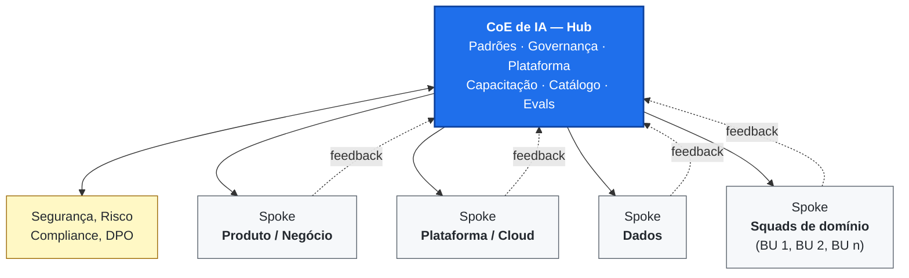
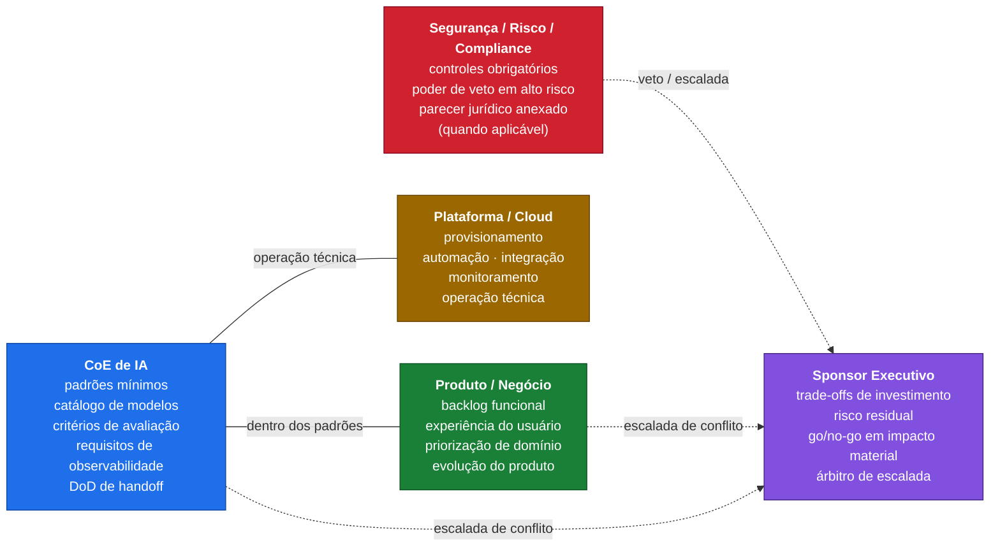

# Diagrama 1 — Hub-and-spoke e modelo federado/híbrido

Este diagrama mostra a essência do modelo operacional de um CoE de IA: um **hub central** que define padrões, governança, plataforma e ativos reutilizáveis, e **spokes federados** (squads de produto, plataforma e dados) que executam casos de uso dentro desses padrões. O CoE pode incubar PoCs/MVPs estratégicos, mas o ownership operacional é transferido para os spokes via **build-to-transfer**.

## Hub-and-spoke conceitual

## Direitos de decisão no modelo federado

## Como ler

- O **hub** decide o que é comum (padrões, plataforma, governança). Os **spokes** decidem o que é específico do domínio.
- **Segurança/Risco/Compliance** tem poder de veto em casos de alto risco; conflitos com o CoE escalam ao Sponsor com prazo definido (Charter §5).
- A seta `feedback` materializa o princípio "padrões evoluem com o uso real": squads informam o hub sobre lacunas e necessidades.
- **Jurídico**, **DPO**, **Auditoria Interna** e **Procurement** entram como colunas independentes do RACI quando a organização é regulada (ver `artefatos/raci-coe-ia.md`).
