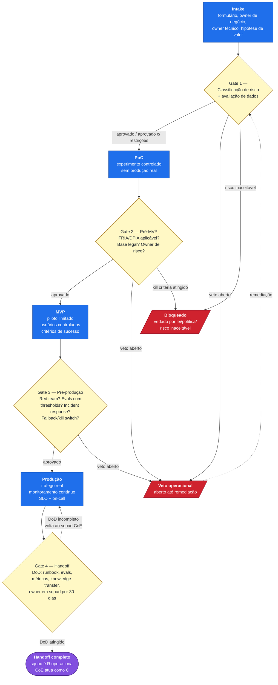
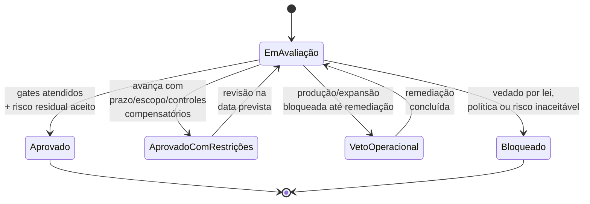

# Diagrama 2 — Fluxo de intake a handoff com gates

Este diagrama mostra o ciclo de vida operacional de um caso de uso de IA dentro do CoE: da entrada no funil de intake até o handoff para o squad de produto. Os **gates operacionais** (classificação de risco, FRIA/DPIA quando aplicável, red team, incident response, evals, fallback) determinam se um caso pode avançar entre estágios. Esses gates protegem produção, dados, clientes e conformidade.

## Funil operacional

**[Descrição acessível]:** flowchart top-bottom de funil go/no-go com 4 estágios principais (Intake → PoC → MVP → Produção → Handoff completo) em azul. Entre estágios há quatro gates em amarelo (G1 classificação de risco; G2 FRIA/DPIA; G3 red team/evals/IR; G4 handoff DoD). De cada gate saem dois caminhos vermelhos: "veto aberto" e (quando aplicável) "risco inaceitável → Bloqueado". O fluxo do veto retorna ao G1 após remediação; o handoff completo é estado terminal em roxo.

## Status possíveis em cada gate

**[Descrição acessível]:** state diagram com estado inicial "Em Avaliação" e quatro estados de saída — Aprovado (terminal), Aprovado Com Restrições, Veto Operacional e Bloqueado (terminal). Restrições e vetos voltam ao estado de avaliação após revisão/remediação. Mostra que o gate é dinâmico: maturidade da organização não imuniza casos individuais.

## Como ler

- Cada **gate** é uma decisão go/no-go que separa maturidade de capacidade organizacional da autorização operacional do caso. Uma organização madura pode, ainda assim, **vetar** um caso específico.
- Gates 2 e 3 ativam as **regras de contenção** documentadas em `assessment/criterios-pontuacao.md`: FRIA/DPIA, AI red teaming, incident response IA, fallback/rollback/kill switch, evals com thresholds.
- O **handoff** é o critério prático de **build-to-transfer**: o squad receptor é o R operacional, com o CoE atuando como consultor. Sem DoD atingido, o caso volta para iteração (ver `artefatos/raci-coe-ia.md` — DoD de transferência).
- O fluxo é cíclico: **expansão** de um caso existente (novos países, dados, ferramentas, autonomia) é tratada como nova decisão go/no-go.
