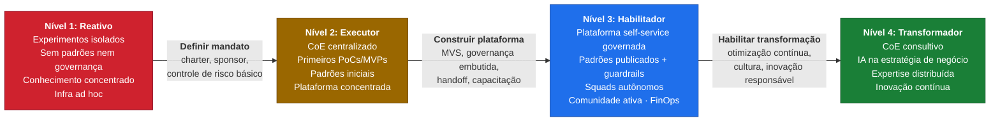
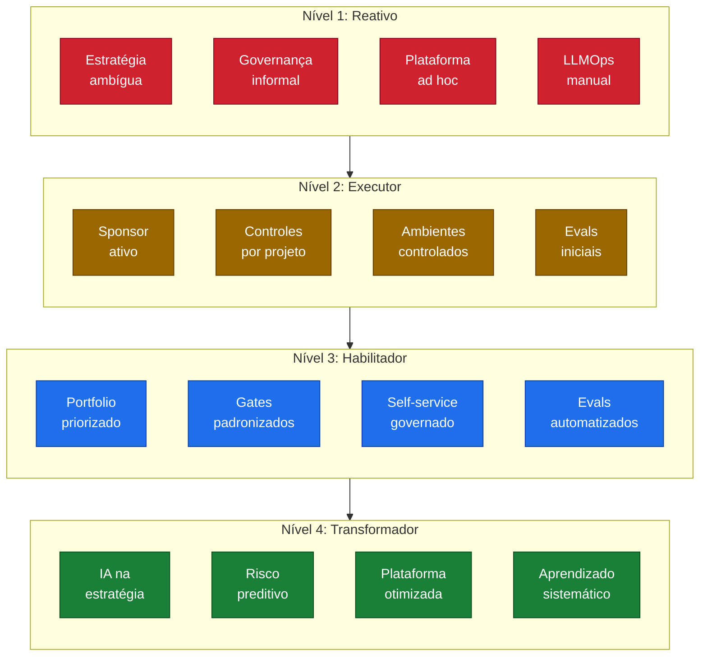
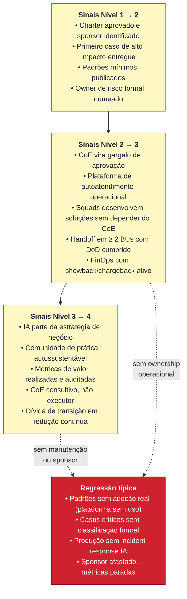

# Diagrama 3. Modelo de maturidade do CoE de IA

Este diagrama mostra a trajetória evolutiva de um CoE de IA em 4 níveis. Cada nível tem características distintas de operação, governança, plataforma e adoção. O assessment de maturidade (em `assessment/`) mede onde a organização está em cada uma das 10 dimensões; o modelo abaixo mostra o **perfil dominante** de cada nível e os principais sinais de transição.

## Evolução em 4 níveis

**[Descrição acessível]:** flowchart esquerda-direita com quatro estágios em cores progressivas: Nível 1 Reativo (vermelho), Nível 2 Executor (âmbar), Nível 3 Habilitador (azul), Nível 4 Transformador (verde). Cada transição é rotulada com a mudança requerida: "Definir mandato" (N1→N2), "Construir plataforma" (N2→N3), "Habilitar transformação" (N3→N4). A progressão de cor comunica intuitivamente direção de maturidade.

## Perfil dominante por dimensão

**[Descrição acessível]:** flowchart top-bottom com quatro subgrupos colados (N1g..N4g) representando perfis dominantes em 4 dimensões (Estratégia, Governança, Plataforma, LLMOps) em cada nível. As cores espelham as do diagrama anterior (vermelho/âmbar/azul/verde). Mostra que cada nível tem um perfil consistente em todas as dimensões dominantes.

## Sinais de transição entre níveis

**[Descrição acessível]:** flowchart top-down listando sinais de transição em três blocos amarelos (N1→N2, N2→N3, N3→N4) com bullets concretos para cada salto. Um bloco vermelho destaca "Regressão típica": perdas que tipicamente fazem a organização recuar (padrões sem adoção, casos críticos sem classificação, produção sem IR, sponsor afastado). Setas pontilhadas indicam caminhos de regressão a partir de transições anteriores.

## Como ler

- O assessment mede maturidade **por dimensão** (10) e calcula um **nível geral** (1–4). Veja `assessment/modelo-maturidade-coe-ia.md` para a definição completa.
- **Maturidade não é monotônica.** Sem manutenção, dimensões críticas (governança, plataforma, operação) podem regredir e disparar contenções automáticas (ver `assessment/criterios-pontuacao.md`).
- **Cada transição exige investimento diferente.** N1→N2 exige clareza estratégica; N2→N3 exige plataforma e disciplina de handoff; N3→N4 exige cultura, métricas de valor e maturidade de portfólio.
- O nível pleno **A** do assessment exige convergência das 10 dimensões; um CoE pode estar em N3 médio com algumas dimensões em N4 e outras em N2; o relatório auditável e o board pack devem refletir essa heterogeneidade.
