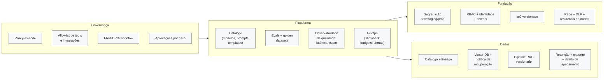

# Diagrama 4 — Arquitetura de referência da plataforma corporativa de IA

Este diagrama mostra a **plataforma comum** que o CoE de IA mantém: landing zone, ambientes segregados, catálogo de modelos, guardrails automatizados, observabilidade e FinOps. A plataforma é o que permite squads desenvolverem soluções com autonomia, dentro de padrões definidos pelo hub.

## Camadas da plataforma

```mermaid
flowchart TB
    classDef consumer fill:#1a7f37,stroke:#0a4d20,color:#fff
    classDef governance fill:#cf222e,stroke:#82071e,color:#fff
    classDef platform fill:#1f6feb,stroke:#0d419d,color:#fff
    classDef foundation fill:#9a6700,stroke:#633c01,color:#fff
    classDef data fill:#8250df,stroke:#3e1f79,color:#fff

    subgraph CONSUMERS["Camada de consumo (squads de produto e BUs)"]
        direction LR
        APP1["App / Copilot<br/>BU 1"]:::consumer
        APP2["RAG / agente<br/>BU 2"]:::consumer
        APP3["Modelo preditivo<br/>BU n"]:::consumer
    end

    subgraph GOV["Camada de governança e controle"]
        direction LR
        POL["Policy-as-code<br/>(quotas, allowlist, filtros)"]:::governance
        RBAC["RBAC + segregação<br/>de ambientes"]:::governance
        RT["AI red teaming<br/>+ harness integrity"]:::governance
    end

    subgraph PLAT["Camada de plataforma de IA (auto-serviço governado)"]
        direction LR
        CAT["Catálogo de<br/>modelos aprovados"]:::platform
        TPL["Templates +<br/>blueprints (IaC)"]:::platform
        EVAL["Suite de evals +<br/>regressão CI/CD"]:::platform
        OBS["Observabilidade<br/>(logs, traces,<br/>métricas, custo)"]:::platform
        FIN["FinOps<br/>(showback, budgets,<br/>circuit breaker)"]:::platform
        GRD["Guardrails<br/>(jailbreak, PII,<br/>schema validation)"]:::platform
    end

    subgraph FOUND["Camada de fundação (landing zone)"]
        direction LR
        ENV["Ambientes<br/>(dev / staging / prod)"]:::foundation
        NET["Rede + secrets +<br/>identidade"]:::foundation
        CI["CI/CD + IaC<br/>(Bicep/Terraform)"]:::foundation
    end

    subgraph DATA["Camada de dados"]
        direction LR
        DCAT["Catálogo de dados<br/>(owners, classificação)"]:::data
        VEC["Vector DB +<br/>índices RAG"]:::data
        LOG["Logs de interação<br/>(retenção, expurgo)"]:::data
    end

    CONSUMERS --> GOV
    GOV --> PLAT
    PLAT --> FOUND
    PLAT --> DATA
    FOUND <--> DATA
```

## Capacidades por camada

## Como ler

- **Squads consomem** a plataforma via templates, catálogo e CI/CD; não recriam controles caso a caso.
- **Governança é embutida**, não tickada manualmente: policy-as-code, RBAC, guardrails e gates rodam automaticamente no pipeline.
- **Observabilidade e FinOps** ficam na plataforma porque servem múltiplas soluções; cada solução instrumenta (L4) o que a plataforma oferece (P5) — ver consistência cruzada em `assessment/criterios-pontuacao.md`.
- A **camada de dados** é separada da camada de plataforma porque tem ciclo de vida e ownership próprios (data owners, retenção, expurgo).
- **Sem fundação**, não há plataforma; sem plataforma, não há autoatendimento governado. A maturidade do CoE depende dessas três camadas funcionarem bem.
