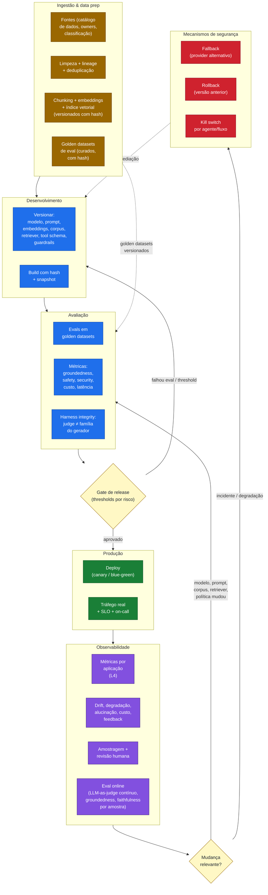
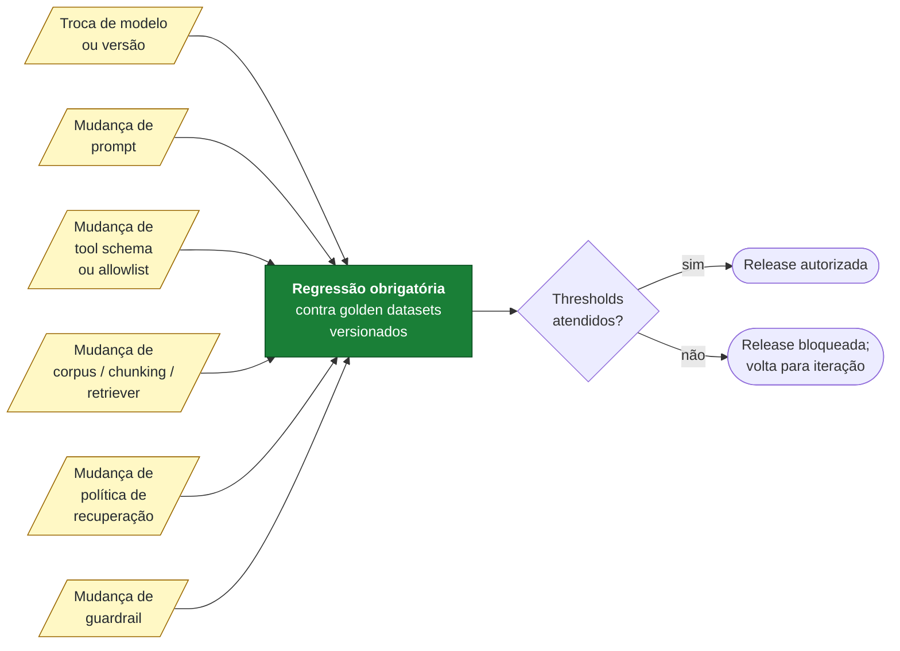
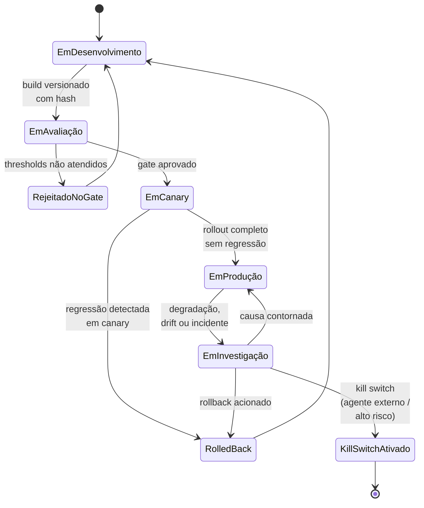

# Diagrama 5 — Pipeline LLMOps/MLOps

Este diagrama mostra o ciclo operacional de versionamento, avaliação, regressão e operação segura de uma solução de IA. O foco é **rastreabilidade**: cada release é traceable até modelo, prompt, embedding, corpus, retriever, tool schema, guardrail e resultado de evals. Sem isso, rollback seletivo e auditoria pós-incidente ficam inviáveis.

## Pipeline ponta a ponta

**[Descrição acessível]:** flowchart top-bottom com seis subgrupos coloridos: Ingestão & Data Prep (âmbar) com fontes/lineage/embeddings/golden datasets; Desenvolvimento (azul) com versionamento + hash/snapshot; Avaliação (azul) com evals em golden datasets, métricas e harness integrity; Produção (verde) com deploy canary e SLO; Observabilidade (roxo) com métricas, drift e amostragem; Mecanismos de Segurança (vermelho) com fallback, rollback e kill switch. Dois gates amarelos (G1 release; G2 mudança relevante) interrompem o fluxo. Setas mostram que Ingestão alimenta Dev e golden datasets para Eval; falhas no G1 retornam ao Dev; incidentes em produção disparam SAFE que retroalimenta Dev.

## Trigger de regressão

**[Descrição acessível]:** flowchart esquerda-direita listando seis gatilhos amarelos (troca de modelo, mudança de prompt, tool schema/allowlist, corpus/chunking/retriever, política de recuperação, guardrail) que convergem em um único nó verde "Regressão obrigatória contra golden datasets versionados". A regressão alimenta um gate "Thresholds atendidos?" — sim libera release; não bloqueia e retorna para iteração.

## Estados de uma versão em produção

**[Descrição acessível]:** state diagram mostrando o ciclo de vida de uma versão: Em Desenvolvimento → Em Avaliação → (Rejeitado no Gate ou Em Canary) → Em Produção → Em Investigação → (Em Produção / Rolled Back / Kill Switch Ativado). Kill Switch Ativado é estado terminal. Rolled Back e Rejeitado retornam ao Desenvolvimento.

## Como ler

- **L1 = versionamento total.** Sem versionar embeddings, índices, retriever e tool schemas, não há reprodutibilidade — o release não é auditável. Prompts versionados em D1 são registrados no catálogo de Diag.04/CP1 (modelos, prompts, templates) — o prompt registry vive na plataforma, não na solução.
- **L2 = evals com harness integrity.** O judge não pode ser da mesma família do gerador (evita circular evaluation). Hash do golden dataset prova que o teste não foi modificado para passar.
- **L3 = regressão em toda mudança relevante.** Qualquer um dos 6 gatilhos da segunda figura obriga regressão; sem isso, o release não pode ir para produção (gate bloqueia).
- **L4 = monitoramento por aplicação.** A plataforma oferece capacidade (P5); a solução tem que instrumentar e usar. **M4 (eval online) é distinto de M1/M2**: M1/M2 são métricas operacionais (latência, custo, drift estatístico); M4 é eval semântica contínua em produção (groundedness, faithfulness, qualidade de resposta) via LLM-as-judge ou amostragem humana. Owner: mesmo da suite de evals offline (EVAL); threshold de amostragem define custo e latência de coleta.
- **L5 = fallback + rollback + contenção testados.** Para agentes externos ou de alto risco, a contenção é obrigatória e por agente/fluxo, não global.

Referências cruzadas: ver `assessment/questionario-assessment.md` dimensão "LLMOps/MLOps e evals" (L1–L5) e `referencias/crosswalk-normativo.md` (Measure / Manage no NIST AI RMF; A.6.2.5 / A.6.2.7 no ISO 42001).
