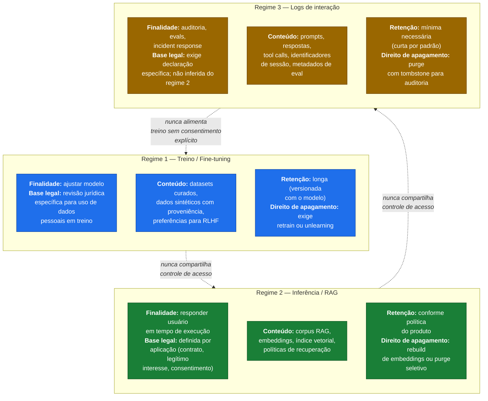
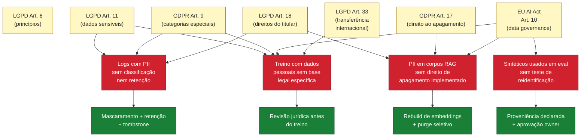

# Diagrama 6 — Regimes de dados (treino × inferência/RAG × logs)

Este diagrama mostra a separação obrigatória entre **três regimes de dados** em sistemas de IA. Cada regime tem finalidade, base legal, retenção, controles e ciclo de vida próprios. Tratar tudo como "dados de IA" mistura responsabilidades e impede auditoria de privacidade — daí a inclusão como gate operacional em D2 do assessment.

## Os três regimes

## Controles obrigatórios por regime

```mermaid
flowchart LR
    classDef tr fill:#1f6feb,stroke:#0d419d,color:#fff
    classDef inf fill:#1a7f37,stroke:#0a4d20,color:#fff
    classDef lg fill:#9a6700,stroke:#633c01,color:#fff

    subgraph TR_CTL["Controles — Treino"]
        TC1["Base legal específica<br/>para dados pessoais"]:::tr
        TC2["Proveniência dos dados<br/>(sintéticos declarados)"]:::tr
        TC3["Aprovação do data owner"]:::tr
        TC4["Teste de memorização<br/>e reidentificação"]:::tr
    end

    subgraph IN_CTL["Controles — Inferência/RAG"]
        IC1["Status de anonimização<br/>declarado (anonimizado /<br/>pseudonimizado / nenhum)"]:::inf
        IC2["Embeddings tratados como<br/>dados pseudonimizados<br/>por definição"]:::inf
        IC3["Política de recuperação<br/>versionada"]:::inf
        IC4["Rebuild de embeddings<br/>quando fonte muda<br/>ou é apagada"]:::inf
    end

    subgraph LG_CTL["Controles — Logs"]
        LC1["Política de retenção<br/>declarada"]:::lg
        LC2["Mascaramento/redacao<br/>de PII"]:::lg
        LC3["Purge automático<br/>+ tombstone para<br/>auditoria"]:::lg
        LC4["Acesso controlado<br/>(quem lê logs?)"]:::lg
    end

    TR_CTL ~~~ IN_CTL ~~~ LG_CTL
```

## Mapa de risco regulatório

## Como ler

- A **separação por regime** é uma exigência operacional declarada em D2 do assessment. Sem ela, não é possível responder a um pedido de Art. 18 LGPD ou Art. 17 GDPR de forma rastreável.
- **Embeddings = dado pseudonimizado por definição** quando derivados de dados pessoais. Apagar a fonte não apaga o embedding — exige rebuild ou purge seletivo do índice vetorial.
- **Logs de interação não são apêndice da aplicação.** Têm finalidade própria, exigem base legal própria e prazo de retenção próprio.
- **Reuso entre regimes é controlado.** Logs não viram dados de treino sem consentimento e revisão; corpus RAG não vira dataset de fine-tuning sem nova base legal.
- Referências cruzadas: ver `assessment/questionario-assessment.md` D2/D3/D4 e `referencias/crosswalk-normativo.md` (tema "Dados e qualidade").
