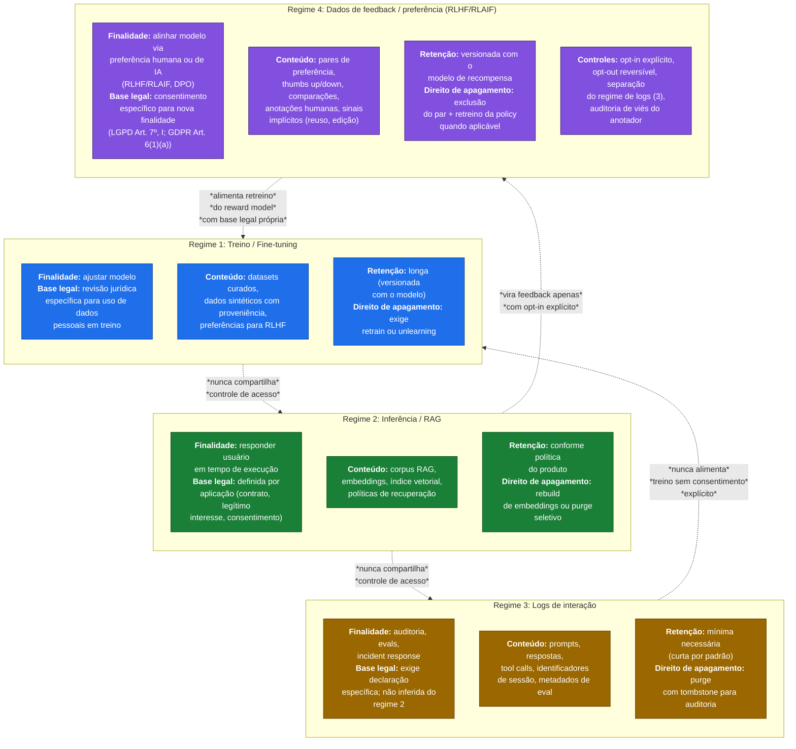
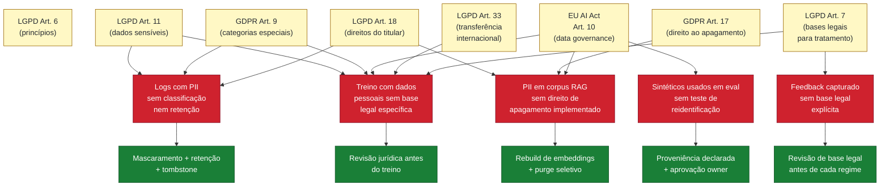

# Diagrama 6. Regimes de dados (treino × inferência/RAG × logs)

> **Verificação regulatória:** referências normativas deste documento conferidas em **maio de 2026**. Datas de vigência, prazos e limites citados exigem revalidação antes de uso em decisão formal. Ver [`referencias/auditoria-referencias.md`](../referencias/auditoria-referencias.md).

Este diagrama mostra a separação obrigatória entre **três regimes de dados** em sistemas de IA. Cada regime tem finalidade, base legal, retenção, controles e ciclo de vida próprios. Tratar tudo como "dados de IA" mistura responsabilidades e impede auditoria de privacidade; daí a inclusão como gate operacional em D2 do assessment.

## Os três regimes

**[Descrição acessível]:** flowchart top-bottom com quatro subgrupos coloridos representando regimes distintos de dados: Regime 1 Treino/Fine-tuning (azul), Regime 2 Inferência/RAG (verde), Regime 3 Logs de Interação (âmbar) e Regime 4 Feedback/Preferência RLHF/RLAIF (roxo). Cada regime declara finalidade, base legal, conteúdo, retenção e direito de apagamento. Setas pontilhadas em itálico mostram restrições de fluxo: TRAIN nunca compartilha com INFER, INFER nunca compartilha com LOG, LOG nunca alimenta TRAIN sem consentimento explícito, INFER vira FEEDBACK só com opt-in, FEEDBACK alimenta retreino do reward model com base legal própria.

## Controles obrigatórios por regime

**[Descrição acessível]:** flowchart esquerda-direita com três subgrupos paralelos (Controles Treino, Inferência/RAG, Logs) listando 4 controles obrigatórios por regime. Os subgrupos não se conectam (operador `~~~`), indicando que os controles são independentes por regime e não devem ser misturados.

```mermaid
flowchart LR
    classDef tr fill:#1f6feb,stroke:#0d419d,color:#fff
    classDef inf fill:#1a7f37,stroke:#0a4d20,color:#fff
    classDef lg fill:#9a6700,stroke:#633c01,color:#fff
    classDef fb fill:#8250df,stroke:#3e1f79,color:#fff

    subgraph TR_CTL["Controles: Treino"]
        TC1["Base legal específica<br/>para dados pessoais"]:::tr
        TC2["Proveniência dos dados<br/>(sintéticos declarados)"]:::tr
        TC3["Aprovação do data owner"]:::tr
        TC4["Teste de memorização<br/>e reidentificação"]:::tr
    end

    subgraph IN_CTL["Controles: Inferência/RAG"]
        IC1["Status de anonimização<br/>declarado (anonimizado /<br/>pseudonimizado / nenhum)"]:::inf
        IC2["Embeddings tratados como<br/>dados pseudonimizados<br/>por definição"]:::inf
        IC3["Política de recuperação<br/>versionada"]:::inf
        IC4["Rebuild de embeddings<br/>quando fonte muda<br/>ou é apagada"]:::inf
    end

    subgraph LG_CTL["Controles: Logs"]
        LC1["Política de retenção<br/>declarada"]:::lg
        LC2["Mascaramento/redacao<br/>de PII"]:::lg
        LC3["Purge automático<br/>+ tombstone para<br/>auditoria"]:::lg
        LC4["Acesso controlado<br/>(quem lê logs?)"]:::lg
    end

    subgraph FB_CTL["Controles: Feedback/RLHF"]
        FC1["Opt-in explícito<br/>antes da coleta"]:::fb
        FC2["Opt-out reversível<br/>(LGPD Art. 7º I;<br/>GDPR Art. 7(3))"]:::fb
        FC3["Separação de armazenamento<br/>do Regime 3 (logs)"]:::fb
        FC4["Auditoria de viés<br/>do anotador"]:::fb
    end

    TR_CTL ~~~ IN_CTL ~~~ LG_CTL ~~~ FB_CTL
```

## Mapa de risco regulatório

**[Descrição acessível]:** flowchart top-down ligando sete dispositivos regulatórios (LGPD Arts. 6, 11, 18, 33; GDPR Arts. 17, 9; EU AI Act Art. 10) (em amarelo) a quatro anti-patterns de risco (PII em RAG sem direito de apagamento; logs com PII sem retenção; sintéticos em eval sem teste de reidentificação; treino com dados pessoais sem base legal) (em vermelho) e finalmente a quatro controles obrigatórios (rebuild de embeddings; mascaramento+retenção+tombstone; proveniência declarada; revisão jurídica) (em verde). As ligações mostram qual dispositivo dispara qual risco e qual controle remedia.

## Como ler

- A **separação por regime** é uma exigência operacional declarada em D2 do assessment. Sem ela, não é possível responder a um pedido de Art. 18 LGPD ou Art. 17 GDPR de forma rastreável.
- **Embeddings = dado pseudonimizado por definição** quando derivados de dados pessoais. Apagar a fonte não apaga o embedding: exige rebuild ou purge seletivo do índice vetorial.
- **Logs de interação não são apêndice da aplicação.** Têm finalidade própria, exigem base legal própria e prazo de retenção próprio.
- **Reuso entre regimes é controlado.** Logs não viram dados de treino sem consentimento e revisão; corpus RAG não vira dataset de fine-tuning sem nova base legal.
- Referências cruzadas: ver `assessment/questionario-assessment.md` D2/D3/D4 e `referencias/crosswalk-normativo.md` (tema "Dados e qualidade").
