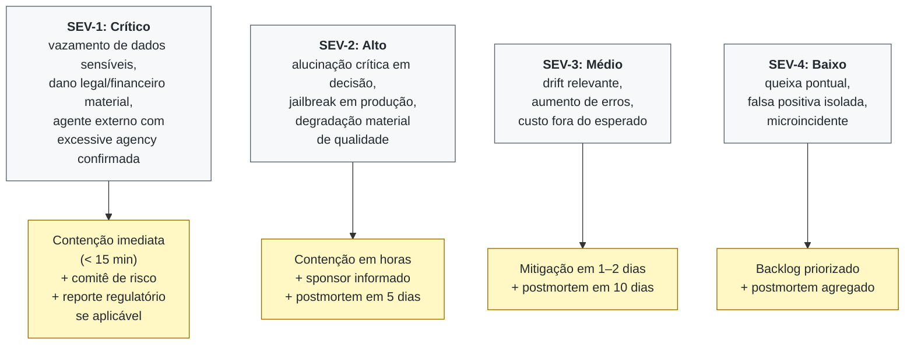
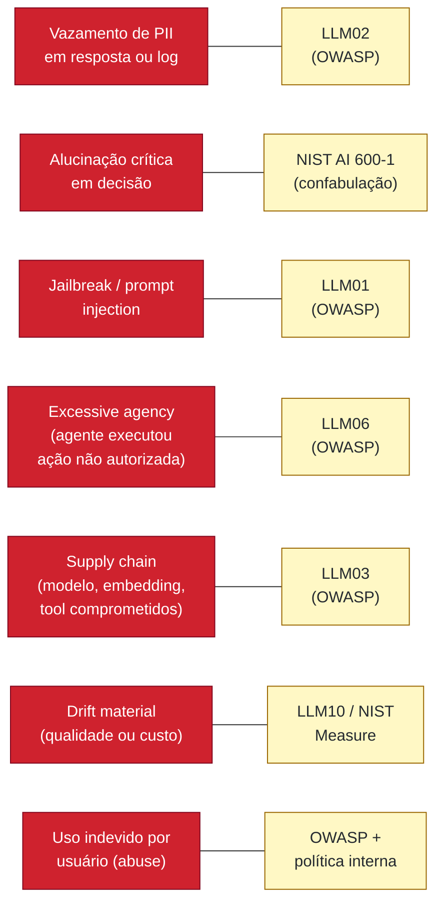

# Diagrama 7. Fluxo de incidente de IA

Este diagrama mostra o ciclo de resposta a incidente quando uma solução de IA em produção falha, vaza, alucina criticamente, é usada indevidamente ou exibe comportamento fora do esperado. **Incident response IA não é o mesmo que incident response geral**: tem categorias próprias (alucinação, jailbreak, vazamento, excessive agency, drift material) e mecanismos próprios (kill switch por agente, rollback de modelo/prompt, evals adversariais).

## Fluxo end-to-end

**[Descrição acessível]:** flowchart top-bottom mostrando o ciclo end-to-end de resposta a incidente de IA em sete fases coloridas: Preparation (azul) com 5 itens NIST SP 800-61 Rev. 3, Detecção (amarelo) com 4 fontes, Triagem (azul) como diamante de decisão, Contenção (vermelho) com 4 mecanismos incluindo kill switch com owner SRE on-call, Investigação (âmbar) com 3 passos, Remediação (verde) com 4 etapas e gate de re-aprovação, Aprendizado (roxo) com postmortem e reporte regulatório (BACEN, ANPD ≤3 dias úteis, EU AI Act, LGPD, GDPR). Setas sólidas mostram fluxo principal; setas pontilhadas mostram feedback loop de LEARN para DETECT e PREP.

```mermaid
flowchart TB
    classDef prep fill:#1f6feb,stroke:#0d419d,color:#fff
    classDef detect fill:#fff8c5,stroke:#9a6700,color:#24292f
    classDef triage fill:#1f6feb,stroke:#0d419d,color:#fff
    classDef contain fill:#cf222e,stroke:#82071e,color:#fff
    classDef investigate fill:#9a6700,stroke:#633c01,color:#fff
    classDef remediate fill:#1a7f37,stroke:#0a4d20,color:#fff
    classDef learn fill:#8250df,stroke:#3e1f79,color:#fff

    subgraph PREP["Preparation (NIST SP 800-61 Rev. 3 abr/2025 / SANS PICERL)"]
        direction LR
        P1["Runbooks publicados<br/>+ versionados"]:::prep
        P2["Kill switches testados<br/>(por agente / fluxo)"]:::prep
        P3["On-call configurado<br/>+ rotações + escalação"]:::prep
        P4["Comunicações<br/>pré-aprovadas<br/>(jurídico, PR, regulador)"]:::prep
        P5["Tabletop exercises<br/>+ revisão periódica"]:::prep
    end

    subgraph DETECT["Detecção"]
        direction LR
        D1["Monitoramento<br/>(drift, alucinação,<br/>custo, latência)"]:::detect
        D2["Feedback do usuário<br/>/ canal de incidente"]:::detect
        D3["Eval em produção<br/>(amostragem)"]:::detect
        D4["Alerta de guardrail<br/>(PII, jailbreak,<br/>excessive agency)"]:::detect
    end

    TRIAGE{"<b>Triagem</b><br/>Severidade?<br/>Escopo de impacto?<br/>Tipo de incidente?"}:::triage

    subgraph CONTAIN["Contenção imediata"]
        direction LR
        C1["Fallback para<br/>versão anterior<br/>ou provider alternativo"]:::contain
        C2["Kill switch (agente/fluxo)<br/>Owner: SRE on-call<br/>SEV-1: aciona imediato<br/>SEV-2: aprovação MLOps Lead<br/>Reversão: gate REM R4"]:::contain
        C3["Bloqueio temporário<br/>do caso de uso"]:::contain
        C4["Comunicação aos<br/>usuários afetados"]:::contain
    end

    subgraph INV["Investigação"]
        direction LR
        I1["Coleta de logs e<br/>traces da janela<br/>do incidente"]:::investigate
        I2["Reprodução em<br/>ambiente isolado"]:::investigate
        I3["Análise de causa<br/>(modelo, prompt,<br/>dados, retriever,<br/>guardrail, tool)"]:::investigate
    end

    subgraph REM["Remediação"]
        direction LR
        R1["Correção técnica<br/>(prompt, modelo, dados,<br/>guardrail, schema)"]:::remediate
        R2["Regressão obrigatória<br/>em golden datasets"]:::remediate
        R3["Atualização de<br/>kill switch / fallback /<br/>rollback"]:::remediate
        R4["Re-aprovação no gate<br/>de produção"]:::remediate
    end

    subgraph LEARN["Aprendizado"]
        direction LR
        L1["Postmortem<br/>(sem blame)"]:::learn
        L2["Atualização de<br/>padrões, runbooks,<br/>evals e guardrails"]:::learn
        L3["Comunicação à<br/>comunidade de prática"]:::learn
        L4["Reporte regulatório:<br/>BACEN Res. 4.893/2021 Art. 6º;<br/>ANPD Res. 15/2024 (≤3 dias úteis, Art. 6º);<br/>EU AI Act Art. 73 (2/10/15 d.);<br/>LGPD Art. 48; GDPR Art. 33"]:::learn
    end

    PREP --> DETECT
    DETECT --> TRIAGE
    TRIAGE -->|crítico ou alto| CONTAIN
    TRIAGE -->|médio ou baixo| INV
    CONTAIN --> INV
    INV --> REM
    REM --> LEARN
    LEARN -.->|melhorias no<br/>pipeline| DETECT
    LEARN -.->|atualiza runbooks,<br/>kill switches, comunicações| PREP
```

## RACI por fase (papéis, não nomes)

> **Como ler:** R = Responsible (executa); A = Accountable (responde formalmente); C = Consulted (parecer obrigatório); I = Informed (ciente). Owner primário concentra A; em SEV-1, autoridade decisória sem aprovação prévia descrita abaixo.

| Fase | Responsible (R) | Accountable (A) | Consulted (C) | Informed (I) | SLA típico |
|---|---|---|---|---|---|
| Preparation (PREP) | Plataforma + AI Owner | CoE de IA / Tech Lead | Risco/Compliance, DPO, Jurídico, PR | Sponsor, Auditoria | trimestral / a cada release major |
| Detection (DETECT) | SRE on-call + AI Owner do caso | SRE Lead | MLOps Lead, Segurança | CoE, DPO | tempo real (alertas) |
| Triagem (TRIAGE) | SRE on-call | SRE Lead (SEV-1/2) ou AI Owner (SEV-3/4) | MLOps Lead, Risco | CoE, Sponsor (SEV-1) | ≤ 15 min (SEV-1/2) |
| Containment (CONTAIN): C2 kill switch | SRE on-call (SEV-1: aciona imediato; SEV-2: aprovação MLOps Lead) | SRE Lead | AI Owner, MLOps Lead, Risco | CoE, Sponsor, Jurídico | ≤ 15 min (SEV-1) / horas (SEV-2) |
| Investigação (INV) | MLOps Lead + AI Owner | AI Owner | Data Owner, Segurança, SRE | CoE, Risco | 1–5 dias úteis |
| Remediação (REM) | Squad do caso + MLOps Lead | AI Owner | CoE (padrões), Risco, Segurança | Sponsor, DPO | conforme gate REM R4 |
| Aprendizado / Postmortem (LEARN) | AI Owner + CoE | CSIRT / Risk Officer | Squads, Plataforma, Jurídico | Sponsor, Auditoria, Comunidade | 5–10 dias úteis (depende SEV) |
| Reporte regulatório (L4) | DPO / Compliance Lead | Sponsor Executivo (assina externamente) | Jurídico, Risco, Comunicação | CoE, Auditoria, ANPD/BACEN/EU AI Office quando aplicável | ANPD ≤ 3 dias úteis (Res. 15/2024); EU AI Act Art. 73 (2/10/15 d.); BACEN Res. 4.893/2021 Art. 6º; LGPD Art. 48; GDPR Art. 33 |

**Notas:**
- A coluna `Accountable` tem **um único papel** por linha. Conflitos de prioridade vão para o Sponsor Executivo via escalada (Charter §5).
- Em organizações que adotaram ISO/IEC 27035-1:2023, a função CSIRT pode acumular Accountable em LEARN; a tabela acima permite ajuste local sem mudar a topologia do diagrama.

## Severidade e SLA de resposta

**[Descrição acessível]:** flowchart top-bottom em duas colunas. Coluna esquerda: quatro caixas de severidade SEV-1 (crítico, vazamento de PII/dano material/excessive agency), SEV-2 (alto, alucinação crítica/jailbreak), SEV-3 (médio, drift relevante) e SEV-4 (baixo, queixa pontual). Coluna direita: SLA correspondente para cada: < 15 min para SEV-1 com comitê de risco e reporte regulatório; horas + postmortem 5d para SEV-2; mitigação 1-2 dias para SEV-3; backlog priorizado para SEV-4.

## Categorias específicas de incidente IA

**[Descrição acessível]:** flowchart esquerda-direita com sete categorias de incidente IA (PII leak, alucinação crítica em decisão, jailbreak/prompt injection, excessive agency de agente, supply chain comprometida, drift material, abuse de usuário) (em vermelho) ligadas a triggers correspondentes em frameworks (LLM02, NIST AI 600-1 confabulação, LLM01, LLM06, LLM03, LLM10/NIST Measure, OWASP + política interna) (em amarelo).

## Como ler

- **Detecção não é só monitoramento técnico.** Inclui feedback do usuário, evals em produção e alertas de guardrail. Sem canal de incidente ativo, problemas viram silêncio.
- **Triagem decide se contém antes ou investiga primeiro.** SEV-1 e SEV-2 contêm imediatamente; SEV-3 e SEV-4 podem investigar primeiro.
- **Contenção tem 4 mecanismos** (fallback, kill switch, bloqueio, comunicação). Para agentes externos e alto risco, o kill switch é obrigatório (ver L5 no assessment).
- **Critério quantitativo de acionamento do kill switch (C2), exemplo de calibragem inicial:**
  - `hallucination rate > 15%` em janela de 5 min em fluxo SEV-1, **ou**
  - `custo/h > 3× baseline` por mais de 10 min com escalada confirmada, **ou**
  - `agente externo com excessive agency confirmada` (ação fora do allowlist), **ou**
  - decisão manual do SRE on-call durante incidente SEV-1.
  Em SEV-1, SRE on-call aciona o kill switch **sem aprovação prévia**; em SEV-2, aciona com aprovação do MLOps Lead. Reversão sempre via gate REM R4 (re-aprovação no gate de produção).
- **Postmortem alimenta a plataforma.** Padrões, runbooks, evals e guardrails são atualizados: incidente vira melhoria sistêmica, não só fix pontual.
- **Reporte regulatório quando aplicável:** EU AI Act Art. 73 (incidente sério em alto risco), LGPD Art. 48 (vazamento de dados pessoais), GDPR Art. 33 (notificação à autoridade), ANPD Res. 15/2024 Art. 6º (notificação em até 3 dias úteis), BACEN Res. 4.893/2021 Art. 6º (instituições financeiras autorizadas pelo BCB).
- Referências cruzadas: `assessment/questionario-assessment.md` G5 / O1–O5, `referencias/crosswalk-normativo.md` (tema "Monitoramento e incidente"), `artigos/coe-ia-playbook.md` (seção sobre incident response).
