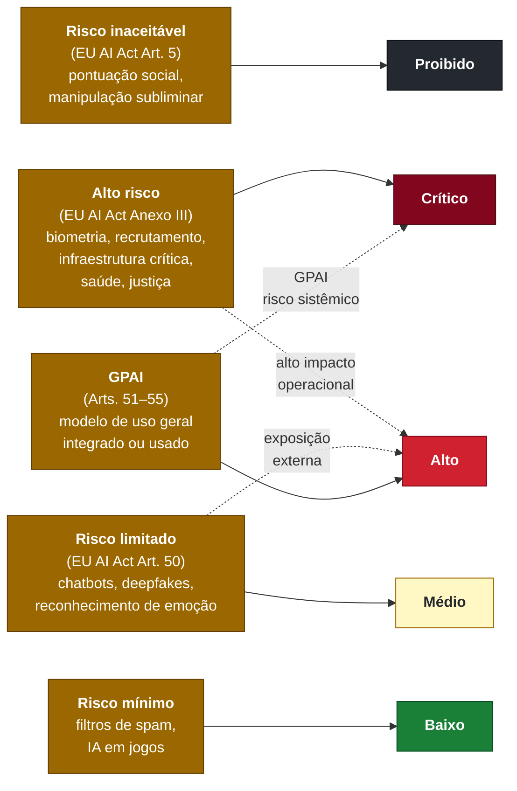
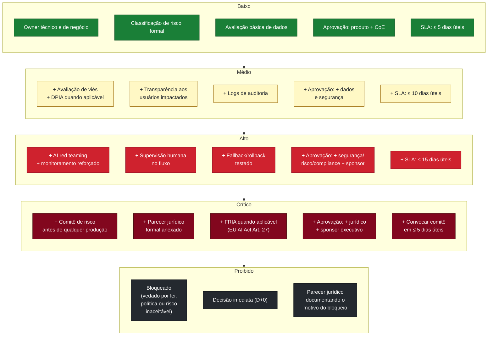
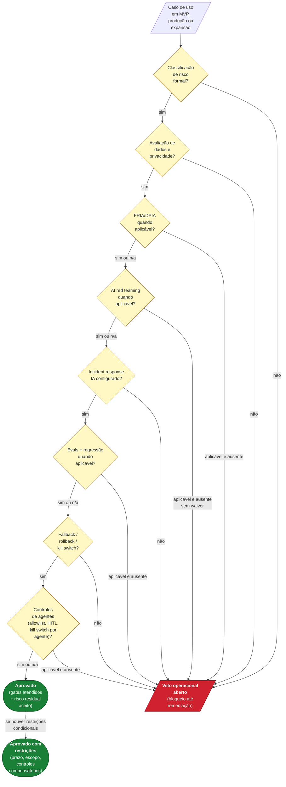

# Diagrama 8. Matriz risco × controles

> **Verificação regulatória:** referências normativas deste documento conferidas em **maio de 2026**. Datas de vigência, prazos e limites citados exigem revalidação antes de uso em decisão formal. Ver [`referencias/auditoria-referencias.md`](../referencias/auditoria-referencias.md).

Este diagrama mostra como a **classificação de risco** (EU AI Act + classificação interna) é traduzida em **controles operacionais** específicos. Cada combinação tem um conjunto mínimo de controles e gates; quanto maior o risco, maior a exigência de evidência e accountability.

## Mapa EU AI Act → classificação interna

**[Descrição acessível]:** flowchart esquerda-direita mapeando cinco categorias do EU AI Act (Risco inaceitável; Alto risco do Anexo III; Risco limitado Art. 50; Risco mínimo; GPAI Arts. 51-55) (em âmbar) a cinco classificações internas (Proibido em cinza escuro; Crítico em vermelho escuro; Alto em vermelho; Médio em amarelo; Baixo em verde). Setas sólidas indicam mapeamento direto; setas pontilhadas mostram escalonamento condicional (ex.: alto impacto operacional eleva alto risco a crítico; GPAI com risco sistêmico vira crítico).

## Controles obrigatórios por classificação interna

**[Descrição acessível]:** flowchart top-bottom com cinco subgrupos empilhados: Baixo (verde), Médio (amarelo), Alto (vermelho), Crítico (vermelho escuro), Proibido (cinza escuro). Cada nível adiciona controles aos níveis anteriores (cumulativo): Baixo tem owner, classificação, avaliação básica, aprovação produto+CoE, SLA 5d; Médio adiciona DPIA, transparência, logs, +dados/segurança, SLA 10d; Alto adiciona red teaming, supervisão humana, fallback, +sponsor, SLA 15d; Crítico adiciona comitê de risco, parecer jurídico, FRIA, SLA convocação 5d; Proibido bloqueia decisão imediata D+0 com parecer jurídico do bloqueio. Setas verticais mostram ordem crescente de risco.

## Gates go/no-go aplicáveis

**[Descrição acessível]:** flowchart top-down mostrando entrada (caso de uso em MVP/produção/expansão) passando por 8 gates sequenciais (G1 classificação; G2 dados/privacidade; G3 FRIA/DPIA; G4 red teaming; G5 IR; G6 evals+regressão; G7 fallback/rollback/kill switch; G8 controles de agentes). Cada gate em amarelo bifurca: "sim ou n/a" segue para o próximo gate; "não" / "aplicável e ausente" direciona para "Veto Operacional Aberto" em vermelho. Sucesso em todos os gates leva a "Aprovado" em verde, com possível ramo para "Aprovado com Restrições" via setas pontilhadas.

## Como ler

- **Risco é cumulativo.** Cada nível adiciona controles aos níveis anteriores. Um caso "Alto" exige tudo do "Baixo" + tudo do "Médio" + os controles próprios.
- **Maturidade ≠ autorização operacional.** A organização pode ser madura (assessment N3 ou N4) e ainda assim ter casos vetados; gates são por caso, não por organização (ver `assessment/criterios-pontuacao.md`).
- **GPAI complica.** Um modelo GPAI pode aparecer em casos de baixo risco e ainda assim disparar obrigações específicas (transparência, GPAI Arts. 51–55). Avaliar separadamente.
- **Veto operacional é a saída padrão quando algum gate aplicável fica em aberto.** Não há "aprovado com pendência crítica": ou remedia, ou veta.
- Referências cruzadas:
  - `artefatos/template-avaliacao-risco-ia.md` (ficha + matriz operacional + DoD)
  - `assessment/criterios-pontuacao.md` (gates operacionais + regras de contenção)
  - `referencias/crosswalk-normativo.md` (EU AI Act, GPAI, FRIA Art. 27)
